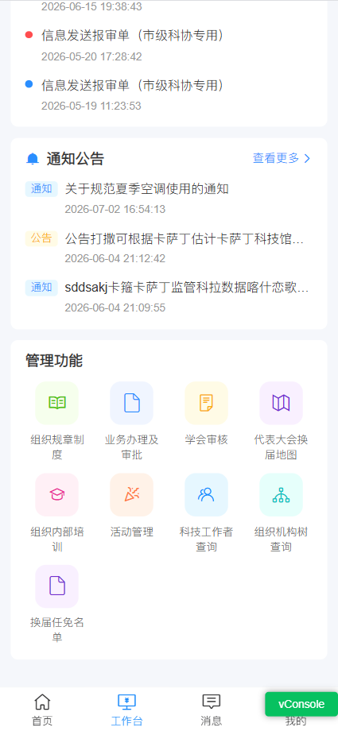
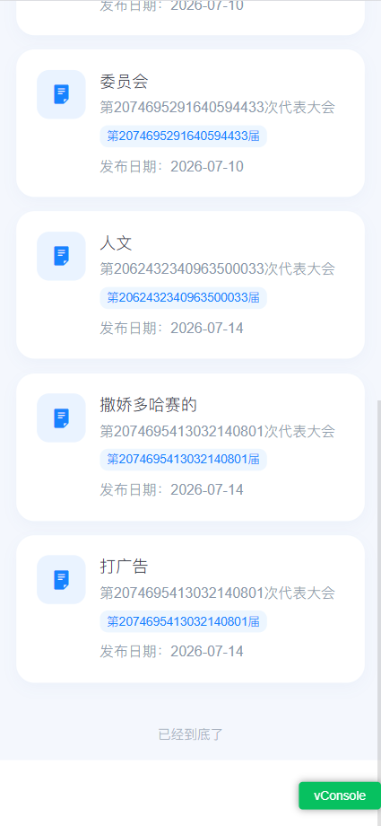
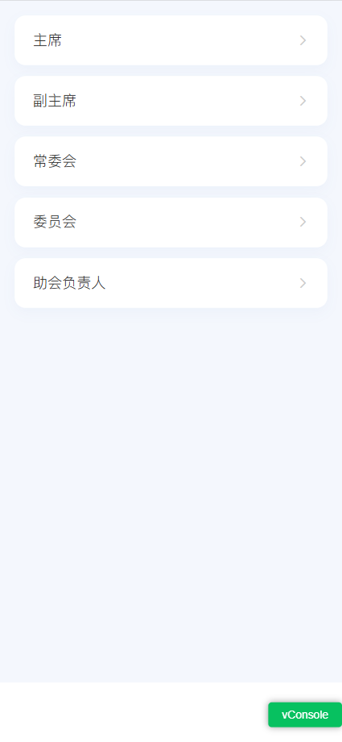
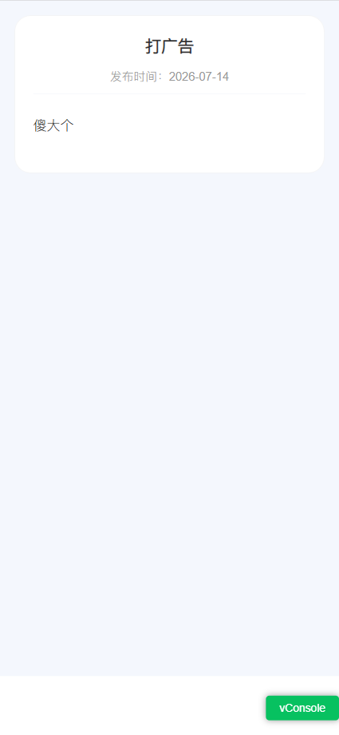

领导安排的练手工作，根据页面原型图编写前端页面并对后端接口进行调用。

## 1. 添加"换届任免名单"模块

在管理功能菜单列表中添加"换届任免名单"模块并配置 icon 图标。

### 菜单配置

```js
const menuList = [
  ...,
  {
    id: 9,
    title: '换届任免名单',
    icon: 'icon-wenjian',
    iconColor: '#722ED1',
    bgColor: '#F9F0FF',
    path: '/workbench/appointment/index',
    isIconfont: true,
  }
]
```

### 菜单渲染

```html
<div class="menu-grid">
  <div class="menu-item" v-for="item in menuList" :key="item.id" @click="goToMenu(item)">
    <div class="menu-icon" :style="{ backgroundColor: item.bgColor }">
      <van-icon v-if="!item.isIconfont" :name="item.icon" :color="item.iconColor" size="24" />
      <i v-else class="iconfont" :class="item.icon" :style="{ color: item.iconColor, fontSize: '24px' }"></i>
    </div>
    <span class="menu-title">{{ item.title }}</span>
  </div>
</div>
```

通过 `v-for` 遍历 `menuList` 数组，根据 `item.isIconfont` 判断使用 vant 图标还是 iconfont 图标。

#### 页面效果图



## 2. 配置路由

在项目路由配置中添加"换届任免名单"相关路由。

```js
{
  path: '/workbench',
  name: 'workbench',
  meta: { title: '工作台' },
  redirect: '/workbench/notice/index',
  children: [
    // ...其他路由
    { path: 'appointment/index', name: 'workbenchAppointmentIndex', component: () => import('@/views/workbench/appointment/index.vue'), meta: { title: '换届任免名单' } },
    { path: 'appointment/positions', name: 'workbenchAppointmentPositions', component: () => import('@/views/workbench/appointment/positions.vue'), meta: { title: '职位分类' } },
    { path: 'appointment/detail', name: 'workbenchAppointmentDetail', component: () => import('@/views/workbench/appointment/detail.vue'), meta: { title: '任免详情' } }
  ]
}
```

## 3. 页面实现详解

### 3.1 index.vue（换届任免列表页）

#### 页面功能

展示换届任免名单列表，支持下拉刷新和上拉加载更多，点击列表项跳转到职位分类页。

#### 代码实现

**导入模块**

```js
import { appointmentList } from '@/api/workbench.js'
import { reactive, ref } from 'vue'
import { useRouter } from 'vue-router'
```

- `appointmentList`：获取任免列表的 API 接口
- `reactive`、`ref`：Vue 3 响应式数据 API
- `useRouter`：Vue Router 路由钩子

**定义响应式变量**

```js
const router = useRouter()
const dataList = ref([])
const loading = ref(false)
const finished = ref(false)
const refreshing = ref(false)
```

| 变量名 | 类型 | 作用 |
| --- | --- | --- |
| `router` | Router | 路由实例，用于页面跳转 |
| `dataList` | ref | 存储任免列表数据 |
| `loading` | ref | 控制列表加载状态 |
| `finished` | ref | 标记是否已加载全部数据 |
| `refreshing` | ref | 控制下拉刷新状态 |

**定义请求参数**

```js
const params = reactive({
  pageNum: 1,
  pageSize: 10,
  id: '',
  title: '',
  congressInfoId: ''
})
```

| 参数名 | 类型 | 作用 |
| --- | --- | --- |
| `pageNum` | number | 当前页码，用于分页 |
| `pageSize` | number | 每页条数，默认 10 |
| `id` | string | 任免 ID，用于精确查询 |
| `title` | string | 任免标题，用于模糊搜索 |
| `congressInfoId` | string | 会议信息 ID，用于筛选 |

**加载数据方法**

```js
const loadData = async () => {
  if (finished.value) return

  try {
    const { rows = [], total = 0 } = await appointmentList(params)

    dataList.value.push(...rows)
    params.pageNum += 1
    finished.value = dataList.value.length >= total || rows.length < params.pageSize
  } catch (error) {
    console.error('加载换届任免信息失败', error)
  } finally {
    loading.value = false
    refreshing.value = false
  }
}
```

- 检查 `finished` 状态，避免重复加载
- 调用 `appointmentList` 接口获取数据
- 将新数据追加到 `dataList` 中，实现滚动加载
- 更新页码，并判断是否已加载全部数据

**下拉刷新方法**

```js
const onRefresh = () => {
  params.pageNum = 1
  dataList.value = []
  finished.value = false
  loading.value = true
  loadData()
}
```

- 重置页码为 1
- 清空列表数据
- 重置加载状态
- 重新加载数据

**跳转详情方法**

```js
const goToDetail = (item) => {
  router.push({
    path: '/workbench/appointment/positions',
    query: {
      id: item.id,
      title: item.title
    }
  })
}
```

- 跳转到职位分类页
- 通过 `query` 参数传递任免 ID 和标题

**日期格式化方法**

```js
const formatDate = (dateStr) => {
  if (!dateStr) return '-'
  return String(dateStr).slice(0, 10)
}
```

- 将日期字符串截取为 `YYYY-MM-DD` 格式

**会议届数格式化方法**

```js
const formatSession = (congressInfoId) => {
  if (congressInfoId === null || congressInfoId === undefined || congressInfoId === '') {
    return '换届任免'
  }
  return `第${congressInfoId}届`
}
```

- 根据 `congressInfoId` 显示会议届数，为空时显示默认文本

#### 模板结构

```html
<div class="page">
  <div class="content">
    <van-pull-refresh v-model="refreshing" class="refresh-wrap" @refresh="onRefresh">
      <van-list v-model:loading="loading" :finished="finished" finished-text="已经到底了" :immediate-check="true" @load="loadData">
        <div class="list-wrap">
          <button v-for="item in dataList" :key="item.id" type="button" class="info-card" @click="goToDetail(item)">
            <div class="icon-wrapper" aria-hidden="true">
              <van-icon name="description" size="24" color="#1683ff" />
            </div>
            <div class="card-content">
              <div class="title">{{ item.title || '未命名换届任免信息' }}</div>
              <div class="subtitle" v-if="item.congressInfoId">第{{ item.congressInfoId }}次代表大会</div>
              <div class="session-tag">{{ formatSession(item.congressInfoId) }}</div>
              <div class="publish-date">发布日期：{{ formatDate(item.createTime) }}</div>
            </div>
          </button>
          <van-empty v-if="finished && dataList.length === 0" image="search" description="暂无任免信息" />
        </div>
      </van-list>
    </van-pull-refresh>
  </div>
  <div class="footer-space"></div>
</div>
```

| 组件 | 作用 |
| --- | --- |
| `van-pull-refresh` | 下拉刷新组件，包裹整个列表 |
| `van-list` | 列表组件，支持滚动加载更多 |
| `van-empty` | 空状态组件，列表为空时显示 |
| `van-icon` | 图标组件，显示文档图标 |

#### 样式设计

```less
.page {
  width: 100%;
  min-height: 100%;
  display: flex;
  flex-direction: column;
  overflow: hidden;
  background: #f4f7fd;
}

.content {
  flex: 1;
  overflow-y: auto;
  -webkit-overflow-scrolling: touch;
}

.footer-space {
  height: 66px;
  background: #fff;
}

.info-card {
  width: 100%;
  min-height: 124px;
  display: flex;
  align-items: flex-start;
  gap: 14px;
  margin: 0 0 14px;
  padding: 20px;
  border: 0;
  border-radius: 18px;
  background: #fff;
  box-shadow: 0 5px 14px rgba(50, 104, 170, 0.04);
  cursor: pointer;
  transition: opacity 0.15s ease, transform 0.15s ease;

  &:active {
    opacity: 0.88;
    transform: scale(0.99);
  }
}
```

- 使用 Flexbox 布局实现响应式页面结构
- `footer-space` 预留底部导航栏空间
- 卡片式设计，带有阴影和圆角
- 点击时有缩放和透明度变化的交互反馈

#### 页面效果图



---

### 3.2 positions.vue（职位分类页）

#### 页面功能

展示职位分类列表，点击职位跳转到任免详情页。

#### 代码实现

**导入模块**

```js
import { onMounted, reactive, ref } from 'vue'
import { useRouter, useRoute } from 'vue-router'
import { showToast } from 'vant'
```

- `onMounted`：组件挂载生命周期钩子
- `useRoute`：获取当前路由信息

**定义变量**

```js
const router = useRouter()
const route = useRoute()

const positions = reactive([
  { id: 'chairman', name: '主席' },
  { id: 'viceChairman', name: '副主席' },
  { id: 'standingCommittee', name: '常委会' },
  { id: 'committee', name: '委员会' },
  { id: 'assistant', name: '助会负责人' }
])
```

| 职位 ID | 职位名称 |
| --- | --- |
| `chairman` | 主席 |
| `viceChairman` | 副主席 |
| `standingCommittee` | 常委会 |
| `committee` | 委员会 |
| `assistant` | 助会负责人 |

**跳转详情方法**

```js
const goToDetail = (position) => {
  router.push({
    path: '/workbench/appointment/detail',
    query: {
      appointmentId: route.query.id,
      positionId: position.id,
      positionName: position.name,
      title: route.query.title
    }
  })
}
```

- 跳转到任免详情页
- 传递任免 ID、职位 ID、职位名称和标题

#### 模板结构

```html
<div class="page">
  <div class="content">
    <div class="positions-container">
      <div class="position-item" v-for="item in positions" :key="item.id" @click="goToDetail(item)">
        <span class="position-name">{{ item.name }}</span>
        <van-icon name="arrow" color="#ccc" size="16" />
      </div>
    </div>
  </div>
  <div class="footer-space"></div>
</div>
```

- 使用 `v-for` 遍历职位列表
- 每个职位项显示职位名称和箭头图标

#### 样式设计

```less
.position-item {
  display: flex;
  border-radius: 12px;
  align-items: center;
  justify-content: space-between;
  padding: 18px 20px;
  margin-bottom: 12px;
  background: #fff;
  box-shadow: 0 5px 14px rgba(50, 104, 170, 0.04);
  transition: opacity 0.15s ease, transform 0.15s ease;

  &:last-child {
    margin-bottom: 0;
  }

  &:active {
    opacity: 0.88;
    transform: scale(0.99);
  }
}
```

- 列表项使用圆角卡片设计
- 左侧显示职位名称，右侧显示箭头图标
- 点击时有缩放和透明度变化的交互反馈

#### 页面效果图



---

### 3.3 detail.vue（任免详情页）

#### 页面功能

展示任免详情信息，包括标题、发布时间和富文本内容。

#### 代码实现

**导入模块**

```js
import { onMounted, reactive } from 'vue'
import { useRoute } from 'vue-router'
import { showToast, showLoadingToast, closeToast } from 'vant'
import { appointmentDetail } from '@/api/workbench.js'
```

- `showLoadingToast`、`closeToast`：vant 加载提示组件
- `appointmentDetail`：获取任免详情的 API 接口

**定义响应式变量**

```js
const route = useRoute()

const detail = reactive({
  title: '',
  publishDate: '',
  createTime: '',
  content: ''
})
```

| 字段 | 类型 | 作用 |
| --- | --- | --- |
| `title` | string | 任免标题 |
| `publishDate` | string | 发布日期 |
| `createTime` | string | 创建时间 |
| `content` | string | 任免内容（HTML 格式） |

**安全渲染 HTML 方法**

```js
const safeHtml = (html) => {
  if (!html) return ''
  return html
    .replace(/<script[^>]*>[\s\S]*?<\/script>/gi, '')
    .replace(/<iframe[^>]*>[\s\S]*?<\/iframe>/gi, '')
    .replace(/on\w+="[^"]*"/gi, '')
}
```

- 过滤 HTML 中的 `<script>` 标签，防止 XSS 攻击
- 过滤 `<iframe>` 标签，防止嵌入恶意页面
- 过滤 `on*` 事件属性，防止事件注入攻击

**日期格式化方法**

```js
const formatDate = (dateStr) => {
  if (!dateStr) return ''
  const match = dateStr.match(/^\d{4}-\d{2}-\d{2}/)
  return match ? match[0] : dateStr
}
```

- 使用正则表达式提取日期部分
- 支持多种日期格式输入

**加载详情方法**

```js
const loadDetail = async () => {
  showLoadingToast({ message: '加载中...', forbidClick: true, duration: 0 })

  try {
    const res = await appointmentDetail(route.query.appointmentId)
    const detailData = res?.data || res

    if (res?.code === 200 && detailData) {
      Object.assign(detail, detailData)
      detail.content = safeHtml(detail.content)
    } else {
      showToast(res?.msg || '暂无数据')
    }
  } catch (error) {
    console.error('获取任免详情失败:', error)
    showToast('获取数据失败')
  } finally {
    closeToast()
  }
}
```

- 显示加载提示，禁止点击
- 调用 `appointmentDetail` 接口获取详情
- 使用 `safeHtml` 处理内容，防止 XSS 攻击
- 根据接口返回码判断是否成功
- 无论成功或失败，都关闭加载提示

**组件挂载**

```js
onMounted(() => {
  loadDetail()
})
```

- 组件挂载时自动加载任免详情

#### 模板结构

```html
<div class="page">
  <div class="content">
    <div class="detail-card">
      <div class="detail-title">{{ route.query.title || detail.title || '-' }}</div>
      <div class="detail-date">发布时间：{{ formatDate(detail.publishDate) || formatDate(detail.createTime) || '-' }}</div>
      <div class="detail-content rich-text" v-html="detail.content || ''"></div>
    </div>
  </div>
  <div class="footer-space"></div>
</div>
```

| 部分 | 作用 |
| --- | --- |
| `detail-title` | 显示任免标题，优先使用路由参数中的标题 |
| `detail-date` | 显示发布时间，优先使用 `publishDate`，其次使用 `createTime` |
| `detail-content` | 使用 `v-html` 渲染富文本内容 |

#### 样式设计

```less
.detail-card {
  background: #fff;
  border-radius: 18px;
  padding: 20px;
  border: 1px solid rgba(0, 0, 0, 0.04);
}

.detail-title {
  font-size: 18px;
  font-weight: 700;
  color: #333;
  line-height: 1.5;
  margin-bottom: 12px;
  text-align: center;
}

.detail-date {
  font-size: 13px;
  color: #999;
  margin-bottom: 20px;
  padding-bottom: 12px;
  border-bottom: 1px solid #f4f5fa;
  text-align: center;
}

.detail-content {
  color: #333;
  font-size: 15px;
  line-height: 2;
}

.rich-text {
  :deep(p) {
    margin: 0 0 16px;
    line-height: 2;
  }

  :deep(ul),
  :deep(ol) {
    padding-left: 22px;
    margin: 16px 0;
  }

  :deep(img) {
    max-width: 100%;
    height: auto;
  }
}
```

- 卡片式布局，带有圆角和边框
- 标题居中显示，使用粗体字
- 发布时间下方有分隔线
- 富文本内容支持段落、列表和图片

#### 页面效果图



---

## 4. 页面流程总结

```
index.vue（任免列表）
    ↓ 点击列表项
positions.vue（职位分类）
    ↓ 点击职位项
detail.vue（任免详情）
```

| 页面 | 路由路径 | 功能 |
| --- | --- | --- |
| index.vue | `/workbench/appointment/index` | 展示任免列表，支持分页加载 |
| positions.vue | `/workbench/appointment/positions` | 展示职位分类，选择具体职位 |
| detail.vue | `/workbench/appointment/detail` | 展示任免详情，渲染富文本内容 |

## 5. 技术要点

### 5.1 响应式数据管理

使用 Vue 3 Composition API 中的 `ref` 和 `reactive` 管理响应式数据：

- `ref`：用于基本类型数据（字符串、数字、布尔值）
- `reactive`：用于对象类型数据

### 5.2 分页加载实现

通过 `van-list` 组件实现滚动加载：

- `loading`：控制加载状态
- `finished`：标记是否已加载全部数据
- `pageNum`：当前页码，每次加载后递增

### 5.3 XSS 防护

在渲染富文本内容时，使用 `safeHtml` 方法过滤危险标签和属性：

- 移除 `<script>` 标签
- 移除 `<iframe>` 标签
- 移除 `on*` 事件属性

### 5.4 路由参数传递

通过 `router.push` 的 `query` 参数传递数据：

- 使用 `route.query` 获取参数
- 参数包括：任免 ID、职位 ID、职位名称、标题

### 5.5 移动端适配

使用 Flexbox 布局和响应式设计：

- `overflow-y: auto` 实现内容滚动
- `-webkit-overflow-scrolling: touch` 优化 iOS 滚动体验
- `footer-space` 预留底部导航栏空间