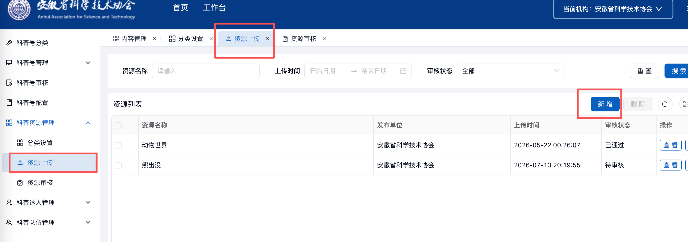
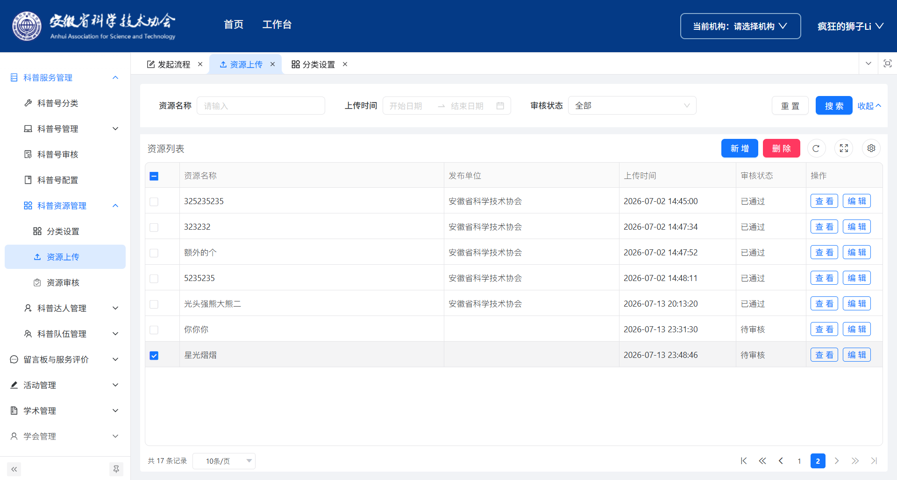

本周主要工作是修复科普资源上传模块中的两个问题：
1. `getAllDept` 函数在 `system.ts` 中读取 `split` 时出现 TypeError（undefined 值）
2. 新增/编辑资源后列表没有刷新

## 1. 模块概述

科普资源上传模块位于 `src/views/popularization/resources/resources-upload` 目录下，包含三个文件：

| 文件 | 功能 |
| --- | --- |
| `index.vue` | 资源列表页，展示已上传的资源列表，支持查看、编辑、删除操作 |
| `form.vue` | 资源上传/编辑表单页，包含资源名称、分类、标签、类型、封面、内容等字段 |
| `data.ts` | 表格列配置和查询表单配置 |

### 页面流程

```
index.vue（资源列表）
    ↓ 点击"新增"按钮
form.vue（上传表单）
    ↓ 提交表单后返回
index.vue（资源列表刷新）
```

---

## 2. index.vue（资源列表页）

### 2.1 页面功能

展示科普资源列表，支持：
- 按资源名称、上传时间、审核状态筛选
- 分页展示
- 查看、编辑、批量删除操作

### 2.2 代码实现

**导入模块**

```ts
import type { VbenFormProps } from '@vben/common-ui';
import type { VxeGridProps } from '#/adapter/vxe-table';
import { getAllDeptId } from '#/utils/system';
import { Page } from '@vben/common-ui';
import { onActivated, onMounted } from 'vue';
import { Modal, Space } from 'ant-design-vue';
import { useVbenVxeGrid, vxeCheckboxChecked } from '#/adapter/vxe-table';
import { columns, querySchema } from './data';
import { useRouter } from 'vue-router';
import {
  popularizationResourceList,
  popularizationResourceDelete,
} from '#/api/business/science-popularization-resources/resources-upload/index';
```

| 导入项 | 说明 |
| --- | --- |
| `VbenFormProps` | Vben 表单组件属性类型定义 |
| `VxeGridProps` | Vxe 表格组件属性类型定义 |
| `getAllDeptId` | 获取当前用户所属独立法人单位 ID |
| `Page` | Vben 页面布局组件 |
| `useVbenVxeGrid` | 封装 Vxe 表格和查询表单的组合式函数 |
| `columns` | 表格列配置（来自 data.ts） |
| `querySchema` | 查询表单配置（来自 data.ts） |
| `popularizationResourceList` | 获取资源列表 API |
| `popularizationResourceDelete` | 删除资源 API |

**表单配置**

```ts
const formOptions: VbenFormProps = {
  commonConfig: {
    labelWidth: 80,
    componentProps: {
      allowClear: true,
    },
  },
  schema: querySchema(),
  wrapperClass: 'grid-cols-1 md:grid-cols-2 lg:grid-cols-3 xl:grid-cols-4',
  fieldMappingTime: [
    [
      'uploadTime',
      ['params[beginTime]', 'params[endTime]'],
      ['YYYY-MM-DD 00:00:00', 'YYYY-MM-DD 23:59:59'],
    ],
  ],
};
```

| 配置项 | 作用 |
| --- | --- |
| `labelWidth` | 表单标签宽度 |
| `allowClear` | 表单组件支持清空 |
| `schema` | 查询表单字段定义 |
| `wrapperClass` | 表单网格布局样式类 |
| `fieldMappingTime` | 日期范围选择器字段映射，将 `uploadTime` 转换为 `beginTime` 和 `endTime` |

**表格配置**

```ts
const gridOptions: VxeGridProps = {
  checkboxConfig: {
    highlight: true,
    reserve: true,
  },
  columns,
  height: 'auto',
  border: true,
  keepSource: true,
  pagerConfig: {},
  proxyConfig: {
    ajax: {
      query: async ({ page }, formValues = {}) => {
        return await popularizationResourceList({
          pageNum: page.currentPage,
          pageSize: page.pageSize,
          ...formValues,
          sourceDeptId: getAllDeptId() ?? ''
        });
      },
    },
  },
  rowConfig: {
    keyField: 'id',
  },
  id: 'resources-upload-index',
};
```

| 配置项 | 作用 |
| --- | --- |
| `checkboxConfig.highlight` | 选中行高亮显示 |
| `checkboxConfig.reserve` | 翻页时保留选中状态 |
| `proxyConfig.ajax.query` | 数据代理查询函数，自动处理分页参数 |
| `sourceDeptId` | 传递当前部门 ID 进行数据过滤 |
| `rowConfig.keyField` | 行唯一标识字段 |

**创建表格实例**

```ts
const [BasicTable, tableApi] = useVbenVxeGrid({
  formOptions,
  gridOptions,
} as any);
```

`useVbenVxeGrid` 返回两个值：
- `BasicTable`：表格组件，用于模板渲染
- `tableApi`：表格 API，用于操作表格（如刷新、获取选中行等）

**查看操作**

```ts
function handleView(row: any) {
  router.push({
    path: '../resourcesExamine/form',
    query: {
      id: row.id,
      type: 'view',
    },
  });
}
```

跳转到资源审核详情页，通过 `query` 参数传递资源 ID 和操作类型。

**新增操作**

```ts
function handleAdd(row: any) {
  router.push({
    path: './form',
    query: {
      type: 'add',
    },
  });
}
```

跳转到表单页，标记为新增模式。

**编辑操作**

```ts
function handleEdit(row: any) {
  router.push({
    path: './form',
    query: {
      id: row.id,
      type: 'edit',
    },
  });
}
```

跳转到表单页，传递资源 ID 和编辑类型。

**批量删除操作**

```ts
function handleMultiDelete() {
  const rows = tableApi.grid.getCheckboxRecords();
  const ids = rows.map((row: any) => row.id);
  Modal.confirm({
    title: '提示',
    okType: 'danger',
    content: `确认删除选中的${ids.length}条记录吗？`,
    onOk: async () => {
      await popularizationResourceDelete(ids);
      await tableApi.query();
    },
  });
}
```

1. 获取选中行数据
2. 提取 ID 数组
3. 弹出确认框
4. 调用删除 API
5. 刷新表格数据

**列表刷新机制**

```ts
onActivated(() => {
  tableApi.query();
});
onMounted(() => {
  tableApi.query();
});
```

| 生命周期钩子 | 作用 |
| --- | --- |
| `onMounted` | 组件首次挂载时执行查询 |
| `onActivated` | 组件从缓存中激活时执行查询（关键：解决列表不刷新问题） |

### 2.3 模板结构

```html
<template>
  <Page :auto-content-height="true">
    <BasicTable table-title="资源列表">
      <template #toolbar-tools>
        <Space>
          <a-button type="primary" @click="handleAdd">
            {{ $t('pages.common.add') }}
          </a-button>
          <a-button :disabled="!vxeCheckboxChecked(tableApi)" danger type="primary" @click="handleMultiDelete">
            {{ $t('pages.common.delete') }}
          </a-button>
        </Space>
      </template>
      <template #action="{ row }">
        <Space>
          <ghost-button @click.stop="handleView(row)"> 查看 </ghost-button>
          <ghost-button @click.stop="handleEdit(row)">
            {{ $t('pages.common.edit') }}
          </ghost-button>
        </Space>
      </template>
    </BasicTable>
  </Page>
</template>
```

| 模板部分 | 作用 |
| --- | --- |
| `#toolbar-tools` | 工具栏插槽，放置新增和删除按钮 |
| `#action` | 操作列插槽，放置查看和编辑按钮 |
| `vxeCheckboxChecked(tableApi)` | 判断是否有选中行，控制删除按钮禁用状态 |

---

## 3. form.vue（资源上传表单页）

### 3.1 页面功能

资源上传/编辑表单，支持三种资源类型：
- **图文**：资源名称、分类、标签、封面、富文本正文
- **音频**：资源名称、分类、标签、封面、音频文件
- **视频**：资源名称、分类、标签、封面、视频文件

### 3.2 代码实现

**导入模块**

```ts
import { Page } from '@vben/common-ui';
import { useTabs } from '@vben/hooks';
import { getAllDept } from '#/utils/system';
import { ref } from 'vue';
import { FileUpload, ImageUpload } from '#/components/upload';
import { Tinymce } from '#/components/tinymce/index';
import { dictDataList } from '#/api/business/science-popularization-resources/category/index';
import {
  add,
  update,
  queryPopularizationResourceById,
  fileData,
} from '#/api/business/science-popularization-resources/resources-upload/index';
```

| 导入项 | 说明 |
| --- | --- |
| `useTabs` | Vben 标签页管理钩子 |
| `getAllDept` | 获取当前用户所属独立法人单位信息 |
| `FileUpload` | 文件上传组件 |
| `ImageUpload` | 图片上传组件 |
| `Tinymce` | 富文本编辑器组件 |
| `dictDataList` | 获取字典数据 API |
| `add/update` | 新增/编辑资源 API |

**资源类型选项**

```ts
const typeOptions = ref([
  {
    value: '1',
    label: '图文',
  },
  {
    value: '2',
    label: '音频',
  },
  {
    value: '3',
    label: '视频',
  },
]);
```

**获取字典数据**

```ts
async function getDictData() {
  const res = await dictDataList({
    dictType: 'popularization_resource_category',
  });
  const res2 = await dictDataList({
    dictType: 'popularization_resource_tags',
  });
  let data = res.rows || [];
  let data2 = res2.rows || [];
  if (data.length) {
    data = JSON.parse(
      JSON.stringify(data)
        .replace(/dictLabel/g, 'label')
        .replace(/dictValue/g, 'value'),
    );
  }
  if (data2.length) {
    data2 = JSON.parse(
      JSON.stringify(data2)
        .replace(/dictLabel/g, 'label')
        .replace(/dictValue/g, 'value'),
    );
  }
  categoryOptions.value = data as [];
  tagOptions.value = data2 as [];
}
```

从后端获取资源分类和标签字典数据，将后端返回的 `dictLabel` 和 `dictValue` 字段转换为前端组件需要的 `label` 和 `value` 格式。

**表单初始数据**

```ts
const INITIAL_FORM_DATA = {
  id: undefined,
  resourceCategory: undefined,
  resourceTags: undefined,
  resourceType: undefined,
  resourceName: undefined,
  imageFileId: undefined,
  resourceContent: undefined,
  resourceFileId: undefined,
  imageFileIds: [] as string[],
  resourceFileIds: undefined as string[] | undefined,
  audioResourceFileIds: undefined as string[] | undefined,
  videoResourceFileIds: undefined as string | undefined,
};
const formData = ref({...INITIAL_FORM_DATA});
```

| 字段 | 类型 | 作用 |
| --- | --- | --- |
| `id` | number | 资源 ID，新增时为 undefined |
| `resourceCategory` | string | 资源分类 |
| `resourceTags` | string[] | 资源标签（多选） |
| `resourceType` | string | 资源类型（1-图文，2-音频，3-视频） |
| `resourceName` | string | 资源名称 |
| `imageFileIds` | string[] | 封面图片 ID 数组 |
| `resourceContent` | string | 图文内容（富文本） |
| `audioResourceFileIds` | string[] | 音频文件 ID 数组 |
| `videoResourceFileIds` | string | 视频文件 ID |

**表单验证规则**

```ts
const formRules = {
  resourceName: { required: true, message: '请输入', trigger: 'blur' },
  resourceCategory: { required: true, message: '请选择', trigger: 'change' },
  resourceTags: { required: true, message: '请选择', trigger: 'change' },
  resourceType: { required: true, message: '请选择', trigger: 'change' },
  imageFileIds: { required: true, message: '请上传', trigger: 'change' },
};
```

**标签解析转换**

```ts
function parseAndConvert(str: string): string[] {
  const numArr = JSON.parse(str) as number[];
  return Array.isArray(numArr) ? numArr.map((item) => item.toString()) : [];
}
```

将后端返回的标签数组字符串（如 `"[1,2,3]"`）解析为字符串数组。

**初始化表单数据（编辑模式）**

```ts
async function initFormData() {
  const id = route.query.id as '';
  const resource = await queryPopularizationResourceById(id);
  formData.value = resource;
  formData.value.resourceTags =
    formData.value.resourceTags && parseAndConvert(formData.value.resourceTags);
  if (formData.value.imageFileId) {
    let params = {
      bizId: formData.value.imageFileId,
    };
    const res = await fileData(params);
    formData.value.imageFileIds = res.rows[0].ossId;
  }
  if (formData.value.resourceFileId) {
    let params = {
      bizId: formData.value.resourceFileId,
    };
    const res = await fileData(params);
    let tempResourceIds = res.rows?.map((item: any) => {
      return item.ossId;
    });
    if (formData.value.resourceType == '3') {
      formData.value.videoResourceFileIds = tempResourceIds?.toString();
    }
    if (formData.value.resourceType == '2') {
      formData.value.audioResourceFileIds = tempResourceIds;
    }
  }
}
```

编辑模式下：
1. 根据 ID 查询资源详情
2. 解析标签数据
3. 根据资源类型处理文件 ID（图片、音频、视频）

**表单提交（关键修复点）**

```ts
function handleSubmit() {
  formRef.value
    .validate()
    .then(async () => {
      let tags = formData.value.resourceTags || [];
      let resourceFileIds = undefined;
      if (formData.value.resourceType == '2') {
        resourceFileIds = formData.value.audioResourceFileIds;
      }
      if (formData.value.resourceType == '3') {
        resourceFileIds = formData.value.videoResourceFileIds?.length
          ? [formData.value.videoResourceFileIds]
          : undefined;
      }
      const allDept = getAllDept();
      let params = {
        id: formData.value.id,
        resourceCategory: formData.value.resourceCategory,
        resourceTags: `[${tags.join(',')}]`,
        resourceType: formData.value.resourceType,
        resourceName: formData.value.resourceName,
        resourceContent:
          formData.value.resourceType == '1'
            ? formData.value.resourceContent
            : undefined,
        imageFileIds: [formData.value.imageFileIds],
        resourceFileIds: resourceFileIds,
        audioResourceFileIds: undefined,
        videoResourceFileIds: undefined,
        sourceDeptId: allDept?.deptId ?? '',
        sourceDeptName: allDept?.deptName ?? ''
      };
      if (params.id) {
        //添加异步
        await update(params);
      } else {
        await add(params);
      }
      handleBack();//添加await后会等待接口响应
    })
    .catch((error: any) => {
      console.log('error', error);
    });
}
```

**问题修复说明**：

原来的代码中，`add(params)` 和 `update(params)` 没有使用 `await`，导致：
1. 接口请求还未完成就执行 `handleBack()`
2. 列表页的 `onActivated` 钩子触发时，后端数据还未更新
3. 因此列表显示的仍然是旧数据

修复方式：在 `add()` 和 `update()` 前添加 `await`，确保数据写入后端后再返回列表页。

**返回列表方法**

```ts
//新增async异步
async function handleBack() {
  resetForm();
  await closeCurrentTab();
}
```

**问题说明**：

- `closeCurrentTab()` 内部会调用 `router.replace()` 跳转到前一个标签页
- 再调用 `router.back()` 会导致导航冲突，导致 `onActivated`/`onMounted` 钩子执行时机异常
- 因此只保留 `closeCurrentTab()` 即可

**组件挂载**

```ts
onMounted(() => {
  const type = route.query.type;
  operType.value = type as '';
  getDictData();
  if (type == 'edit') {
    initFormData();
  }
});
```

### 3.3 模板结构

```html
<template>
  <Page :auto-content-height="true">
    <a-card title="科普资源上传">
      <a-form
        ref="formRef"
        :rules="formRules"
        :style="{ width: '80%' }"
        :model="formData"
        :label-col="{ span: 4 }"
        :wrapper-col="{ span: 20 }"
        autocomplete="off"
      >
        <a-form-item label="资源名称" name="resourceName">
          <a-input v-model:value="formData.resourceName" placeholder="请输入"></a-input>
        </a-form-item>
        <a-form-item label="所属分类" name="resourceCategory">
          <a-select v-model:value="formData.resourceCategory" :options="categoryOptions" placeholder="请选择"></a-select>
        </a-form-item>
        <a-form-item label="资源标签" name="resourceTags">
          <a-select mode="multiple" v-model:value="formData.resourceTags" :options="tagOptions" placeholder="请选择"></a-select>
        </a-form-item>
        <a-form-item label="资源类型" name="resourceType">
          <a-radio-group v-model:value="formData.resourceType" :options="typeOptions" />
        </a-form-item>
        <a-form-item label="资源封面" name="imageFileIds">
          <ImageUpload :multiple="true" :max-count="1" :max-size="5" accept=".png,.jpg,.svg,.gif" v-model:value="formData.imageFileIds">
            <template #helpMessage>
              <div class="upload-help-message">支持格式：.png，.jpg，.svg，.gif，单个文件不超过5MB</div>
            </template>
          </ImageUpload>
        </a-form-item>
        <a-form-item label="文章正文" name="resourceContent" v-if="formData.resourceType == '1'">
          <Tinymce v-model="formData.resourceContent"></Tinymce>
        </a-form-item>
        <a-form-item label="选择文件" name="resourceFileIds" v-if="formData.resourceType == '2'">
          <FileUpload :multiple="true" :max-count="10" :max-size="20" accept=".mp3,.wav,.ogg" v-model:value="formData.audioResourceFileIds">
            <template #helpMessage>
              <div class="upload-help-message">支持格式：.mp3，.wav，.ogg，限制20MB</div>
            </template>
          </FileUpload>
        </a-form-item>
        <a-form-item label="选择文件" name="resourceFileIds" v-if="formData.resourceType == '3'">
          <FileUpload :max-count="1" :max-size="100" accept=".mp4,.mov" v-model:value="formData.videoResourceFileIds">
            <template #helpMessage>
              <div class="upload-help-message">支持格式：.mp4，.mov，限制100MB</div>
            </template>
          </FileUpload>
        </a-form-item>
      </a-form>
      <div class="form-footer">
        <a-button @click="handleBack">取消</a-button>
        <a-button type="primary" style="margin-left: 40px !important" @click="handleSubmit">提交</a-button>
      </div>
    </a-card>
  </Page>
</template>
```

| 表单字段 | 组件 | 说明 |
| --- | --- | --- |
| 资源名称 | `a-input` | 文本输入 |
| 所属分类 | `a-select` | 单选下拉 |
| 资源标签 | `a-select` | 多选下拉（`mode="multiple"`） |
| 资源类型 | `a-radio-group` | 单选按钮组 |
| 资源封面 | `ImageUpload` | 图片上传（最多1张，5MB） |
| 文章正文 | `Tinymce` | 富文本编辑器（仅图文类型显示） |
| 音频文件 | `FileUpload` | 音频上传（最多10个，20MB） |
| 视频文件 | `FileUpload` | 视频上传（最多1个，100MB） |

---

## 4. data.ts（表格配置）

### 4.1 审核状态选项

```ts
const statusOptions = reactive([
  { value: '', label: '全部' },
  { value: '0', label: '待审核' },
  { value: '1', label: '已通过' },
  { value: '2', label: '退回补正' },
]);
```

### 4.2 状态值转标签

```ts
function getLabelByValue(val: any) {
  let item = statusOptions.filter((item) => {
    return item.value == val;
  })[0];
  return item?.label || '';
}
```

根据状态值获取对应的标签文本。

### 4.3 查询表单配置

```ts
export const querySchema: FormSchemaGetter = () => [
  {
    component: 'Input',
    fieldName: 'resourceName',
    label: '资源名称',
  },
  {
    component: 'RangePicker',
    fieldName: 'uploadTime',
    label: '上传时间',
  },
  {
    component: 'Select',
    fieldName: 'resourceStatus',
    label: '审核状态',
    defaultValue: '',
    componentProps: {
      getPopupContainer,
      options: statusOptions,
    },
  },
];
```

### 4.4 表格列配置

```ts
export const columns: VxeGridProps['columns'] = [
  { type: 'checkbox', width: 60, align: 'left' },
  { title: '资源名称', field: 'resourceName', align: 'left' },
  { title: '发布单位', field: 'sourceDeptName', align: 'left', width: 300 },
  { title: '上传时间', field: 'uploadTime', align: 'left', width: 200 },
  {
    title: '审核状态',
    field: 'resourceStatus',
    align: 'left',
    width: 120,
    slots: {
      default: ({ row }) => {
        if (row.resourceStatus) {
          return getLabelByValue(row.resourceStatus);
        } else {
          return '/';
        }
      },
    },
  },
  {
    field: 'action',
    fixed: 'right',
    width: 'auto',
    align: 'left',
    slots: { default: 'action' },
    title: '操作',
    resizable: false,
  },
];
```

| 列 | 字段 | 说明 |
| --- | --- | --- |
| 复选框 | - | 用于批量选择 |
| 资源名称 | `resourceName` | 资源标题 |
| 发布单位 | `sourceDeptName` | 上传资源的部门名称 |
| 上传时间 | `uploadTime` | 资源上传时间 |
| 审核状态 | `resourceStatus` | 通过插槽渲染中文标签 |
| 操作 | `action` | 固定在右侧，包含查看和编辑按钮 |

---

## 5. API 文件

### 5.1 接口定义

```ts
enum Api {
  root = '/manager/popularizationResource',
  popularizationResourceList = '/manager/popularizationResource/list',
  fileData = '/manager/fileData/list',
  checkList = 'manager/popularizationApproval/list',
}
```

### 5.2 接口函数

| 函数 | 方法 | 路径 | 说明 |
| --- | --- | --- | --- |
| `popularizationResourceList` | GET | `/manager/popularizationResource/list` | 获取资源列表 |
| `queryPopularizationResourceById` | GET | `/manager/popularizationResource/{id}` | 根据 ID 查询资源 |
| `add` | POST | `/manager/popularizationResource` | 新增资源 |
| `update` | PUT | `/manager/popularizationResource` | 编辑资源 |
| `check` | POST | `/manager/popularizationResource/check` | 审核资源 |
| `popularizationResourceDelete` | DELETE | `/manager/popularizationResource/{ids}` | 删除资源 |
| `fileData` | GET | `/manager/fileData/list` | 获取附件列表 |

---

## 6. 问题修复详解

### 6.1 问题一：TypeError - 读取 undefined 的 split

**问题描述**

在 `system.ts` 的 `getAllDept` 函数中，当 `userInfo.allDeptId` 或 `userInfo.allDeptName` 为 undefined 时，调用 `.split('/')` 会抛出 TypeError。

**修复前代码**

```ts
export function getAllDept() {
  let dept: any = {};
  let userInfo = window.sessionStorage.getItem('userInfo') as any;
  if (userInfo) {
    userInfo = JSON.parse(userInfo);
    dept.deptId = userInfo.allDeptId.split('/')[0];  // 当 allDeptId 为 undefined 时报错
    dept.deptName = userInfo.allDeptName.split('/')[0];  // 当 allDeptName 为 undefined 时报错
    // ...
  }
  return dept;
}
```

**修复后代码**

```ts
export function getAllDept() {
  let dept: any = {};
  let userInfo = window.sessionStorage.getItem('userInfo') as any;
  if (userInfo) {
    userInfo = JSON.parse(userInfo);
    //增加空值检查
    dept.deptId = (userInfo.allDeptId || '').split('/')[0];
    dept.deptName = (userInfo.allDeptName || '').split('/')[0];
    if (dept.deptId && dept.deptId.length === 3) {
      dept.deptId = Number(dept.deptId);
    }
  }
  return dept;
}
```

**修复原理**：使用 `(userInfo.allDeptId || '')` 进行空值判断，当 `allDeptId` 为 undefined 时，使用空字符串替代，避免调用 split 时报错。

### 6.2 问题二：新增/编辑后列表不刷新

**问题描述**

在 `form.vue` 的 `handleSubmit` 函数中，`add()` 和 `update()` 没有使用 `await`，导致表单提交后立即返回列表页，但后端数据还未完成写入，因此列表显示的仍然是旧数据。

**修复前代码**

```ts
function handleSubmit() {
  formRef.value
    .validate()
    .then(() => {
      // ...构建参数
      if (params.id) {
        update(params);  // 没有 await，异步操作
      } else {
        add(params);  // 没有 await，异步操作
      }
      handleBack();  // 立即返回，不等接口响应
    })
    // ...
}
```

**修复后代码**

```ts
function handleSubmit() {
  formRef.value
    .validate()
    .then(async () => {
      // ...构建参数
      if (params.id) {
        await update(params);  // 等待接口响应
      } else {
        await add(params);  // 等待接口响应
      }
      handleBack();  // 数据写入完成后再返回
    })
    // ...
}
```

**修复原理**：
1. 在 `.then()` 回调中添加 `async` 关键字
2. 在 `add()` 和 `update()` 前添加 `await`，确保接口请求完成后再执行后续操作
3. 返回列表页时，`onActivated` 钩子触发，调用 `tableApi.query()` 获取最新数据

**配合列表页的刷新机制**

列表页通过 `onActivated` 钩子确保每次回到该页面时都重新查询数据：

```ts
onActivated(() => {
  tableApi.query();
});
```

**修复前效果**



**修复后效果**



### 6.3 修复前后对比

**修复前**

```
用户点击提交
    ↓
调用 add(params)（异步，不等待）
    ↓
立即执行 handleBack()
    ↓
跳转到列表页
    ↓
onActivated 触发，查询列表（此时后端数据还未更新）
    ↓
列表显示旧数据（问题）
```

**修复后**

```
用户点击提交
    ↓
await add(params)（等待接口响应）
    ↓
后端数据写入完成
    ↓
执行 handleBack()
    ↓
跳转到列表页
    ↓
onActivated 触发，查询列表（此时后端数据已更新）
    ↓
列表显示新数据（正常）
```

---

## 7. 技术要点

### 7.1 异步操作处理

在处理表单提交时，需要注意异步操作的顺序：

- 使用 `await` 确保接口请求完成后再执行后续操作
- 避免在异步操作未完成时就跳转页面

### 7.2 空值安全检查

访问对象属性时，应进行空值检查：

```ts
// 不安全
userInfo.allDeptId.split('/')[0]

// 安全
(userInfo.allDeptId || '').split('/')[0]
```

### 7.3 路由导航钩子

Vue Router 的导航钩子在标签页管理场景中的使用：

- `onActivated`：组件从缓存中激活时触发，适合刷新数据
- 避免在标签页切换时同时调用 `closeCurrentTab()` 和 `router.back()`，会导致导航冲突

### 7.4 响应式数据管理

使用 `ref` 和 `reactive` 管理表单数据：

- `ref`：用于基本类型和对象，通过 `.value` 访问
- `reactive`：用于复杂对象，直接访问属性

### 7.5 表单验证

Ant Design Vue 表单验证的使用：

- 通过 `ref` 获取表单实例
- 调用 `validate()` 进行验证
- 在 `.then()` 中处理验证通过后的逻辑

---

## 8. 总结

本周修复了两个问题：
1. 通过添加空值检查修复了 `getAllDept` 函数的 TypeError
2. 通过添加 `await` 确保异步操作完成后再返回列表页，修复了列表不刷新的问题

修复的核心思路是：
- **问题一**：防御性编程，对可能为 undefined 的值进行空值判断
- **问题二**：正确处理异步操作的执行顺序，确保数据写入完成后再进行页面跳转