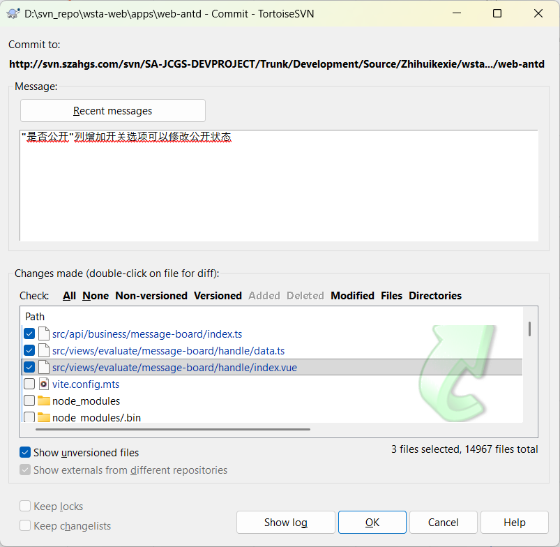
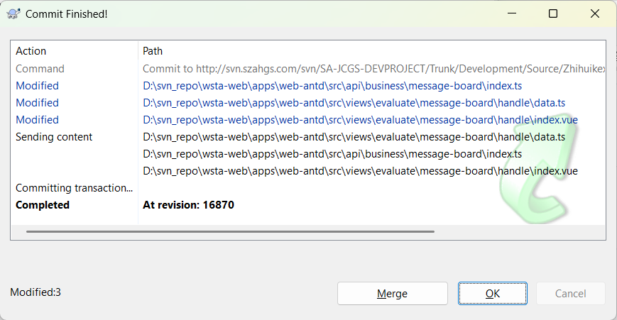

本周主要工作是开发留言板处理模块，该模块位于 `src/views/message-board/handle` 目录下，包含留言列表展示、留言答复、留言查看、公开状态切换等功能。

## 1. 模块概述

留言板处理模块用于管理和处理用户提交的留言信息，主要功能包括：

| 功能 | 说明 |
| --- | --- |
| 留言列表展示 | 展示所有留言，支持按标题、时间、办理状态筛选 |
| 留言查看 | 查看留言详细信息，包括留言内容、附件、答复内容 |
| 留言答复 | 对未答复的留言进行答复，支持首次答复和二次答复 |
| 公开状态切换 | 通过开关控制留言是否公开显示 |
| 附件下载 | 支持下载留言附件（图片、PDF、其他文件） |

### 文件结构

```
handle/
├── data.ts          # 表格列配置和查询表单配置
├── index.vue        # 留言列表页
├── form.vue         # 留言答复/查看页
└── message-board/
    └── index.ts     # API 接口定义
```

### 页面流程

```
index.vue（留言列表）
    ↓ 点击"答复"按钮
form.vue（留言答复）
    ↓ 提交答复后返回
index.vue（留言列表刷新）

index.vue（留言列表）
    ↓ 点击"查看"按钮
form.vue（留言查看）
```

---

## 2. data.ts（表格配置）

### 2.1 办理状态选项

```ts
const statusOptions = reactive([
  { label: '全部', value: '' },
  { label: '已答复', value: '1' },
  { label: '待答复', value: '0' },
]);
```

| 值 | 标签 | 说明 |
| --- | --- | --- |
| `''` | 全部 | 查询所有状态的留言 |
| `'1'` | 已答复 | 查询已处理的留言 |
| `'0'` | 待答复 | 查询未处理的留言 |

使用 `reactive` 定义响应式状态选项数组，供查询表单的下拉选择器使用。

### 2.2 查询表单配置

```ts
export const querySchema: FormSchemaGetter = () => [
  {
    component: 'Input',
    fieldName: 'noticeTitle',
    label: '留言标题',
  },
  {
    component: 'RangePicker',
    fieldName: 'noticeTime',
    label: '留言时间',
  },
  {
    component: 'Select',
    fieldName: 'handleStatus',
    label: '办理状态',
    defaultValue: '',
    componentProps: {
      getPopupContainer,
      options: statusOptions,
    },
  },
];
```

| 字段 | 组件 | 说明 |
| --- | --- | --- |
| `noticeTitle` | `Input` | 留言标题，支持模糊搜索 |
| `noticeTime` | `RangePicker` | 留言时间范围选择器 |
| `handleStatus` | `Select` | 办理状态下拉选择 |

**关键配置说明**：

- `getPopupContainer`：用于设置下拉菜单的挂载容器，解决弹窗被遮挡的问题
- `defaultValue: ''`：办理状态默认选中"全部"

### 2.3 表格列配置

```ts
export const columns: VxeGridProps['columns'] = [
  {
    title: '留言标题',
    field: 'noticeTitle',
    align: 'left',
  },
  {
    title: '是否公开',
    field: 'isPublic',
    align: 'center',
    width: 100,
    slots: {
      default: 'isPublic',
    },
  },
  {
    title: '留言时间',
    field: 'noticeTime',
    align: 'left',
    width: 200,
  },
  {
    title: '办理状态',
    field: 'handleStatus',
    align: 'left',
    width: 100,
    slots: {
      default: ({ row }) => {
        if (row.handleStatus == '1') {
          return '已答复';
        } else {
          return '待答复';
        }
      },
    },
  },
  {
    field: 'action',
    fixed: 'right',
    width: 'auto',
    align: 'left',
    slots: { default: 'action' },
    title: '操作',
    resizable: false,
  },
];
```

| 列 | 字段 | 宽度 | 说明 |
| --- | --- | --- | --- |
| 留言标题 | `noticeTitle` | 自适应 | 显示留言标题 |
| 是否公开 | `isPublic` | 100px | 通过插槽渲染开关组件 |
| 留言时间 | `noticeTime` | 200px | 显示留言提交时间 |
| 办理状态 | `handleStatus` | 100px | 通过插槽渲染中文标签 |
| 操作 | `action` | 自适应 | 固定在右侧，包含查看/答复按钮 |

**关键技术点**：

1. **插槽机制**：`slots.default` 用于自定义单元格渲染内容
   - `isPublic` 列使用 `default: 'isPublic'`，在模板中通过 `<template #isPublic>` 自定义渲染
   - `handleStatus` 列使用函数形式，根据状态值返回不同文本

2. **状态值转换**：`handleStatus` 字段存储的是数字字符串（`'0'` 或 `'1'`），通过函数转换为中文标签显示

3. **操作列固定**：`fixed: 'right'` 确保操作列始终显示在表格右侧，方便用户操作

---

## 3. index.vue（留言列表页）

### 3.1 页面功能

展示留言列表，支持：
- 按留言标题、留言时间、办理状态筛选
- 分页展示
- 查看已答复留言详情
- 答复未处理留言
- 切换留言公开状态

### 3.2 代码实现

**导入模块**

```ts
import type { VbenFormProps } from '@vben/common-ui';
import type { VxeGridProps } from '#/adapter/vxe-table';
import { Page } from '@vben/common-ui';
import { message } from 'ant-design-vue';
import { Space, Modal } from 'ant-design-vue';
import { getVxePopupContainer } from '@vben/utils';
import { useVbenVxeGrid } from '#/adapter/vxe-table';
import { columns, querySchema } from './data';
import { useRouter } from 'vue-router';
import { noticeBoardList, updatePublic } from '#/api/business/message-board/index';
import { onActivated } from 'vue';
```

| 导入项 | 说明 |
| --- | --- |
| `VbenFormProps` | Vben 表单组件属性类型定义 |
| `VxeGridProps` | Vxe 表格组件属性类型定义 |
| `Page` | Vben 页面布局组件 |
| `message` | Ant Design Vue 消息提示组件 |
| `Modal` | Ant Design Vue 模态框组件 |
| `useVbenVxeGrid` | 封装 Vxe 表格和查询表单的组合式函数 |
| `columns` | 表格列配置（来自 data.ts） |
| `querySchema` | 查询表单配置（来自 data.ts） |
| `noticeBoardList` | 获取留言列表 API |
| `updatePublic` | 更新留言公开状态 API |
| `onActivated` | 组件从缓存中激活时触发的生命周期钩子 |

**表单配置**

```ts
const formOptions: VbenFormProps = {
  commonConfig: {
    labelWidth: 80,
    componentProps: {
      allowClear: true,
    },
  },
  schema: querySchema(),
  wrapperClass: 'grid-cols-1 md:grid-cols-2 lg:grid-cols-3 xl:grid-cols-4',
  fieldMappingTime: [
    [
      'noticeTime',
      ['params[beginTime]', 'params[endTime]'],
      ['YYYY-MM-DD 00:00:00', 'YYYY-MM-DD 23:59:59'],
    ],
  ],
};
```

| 配置项 | 作用 |
| --- | --- |
| `labelWidth` | 表单标签宽度，设置为 80px |
| `allowClear` | 表单组件支持一键清空 |
| `schema` | 查询表单字段定义，调用 `querySchema()` 获取 |
| `wrapperClass` | 表单网格布局样式类，响应式显示 1-4 列 |
| `fieldMappingTime` | 日期范围选择器字段映射，将 `noticeTime` 转换为 `beginTime` 和 `endTime` |

**日期字段映射详解**：

`fieldMappingTime` 配置将前端的 `noticeTime`（日期范围选择器值）自动转换为后端需要的两个参数：
- `params[beginTime]`：开始时间，格式为 `YYYY-MM-DD 00:00:00`
- `params[endTime]`：结束时间，格式为 `YYYY-MM-DD 23:59:59`

这样前端只需要处理一个日期范围字段，后端接收到的是两个独立的时间参数。

**表格配置**

```ts
const gridOptions: VxeGridProps = {
  border: true,
  checkboxConfig: {
    highlight: true,
    reserve: true,
  },
  columns,
  height: 'auto',
  keepSource: true,
  pagerConfig: {},
  proxyConfig: {
    ajax: {
      query: async ({ page }, formValues = {}) => {
        return await noticeBoardList({
          pageNum: page.currentPage,
          pageSize: page.pageSize,
          ...formValues,
        });
      },
    },
  },
  rowConfig: {
    keyField: 'id',
  },
  id: 'massage-board-handle-index',
};
```

| 配置项 | 作用 |
| --- | --- |
| `border` | 显示表格边框 |
| `checkboxConfig.highlight` | 选中行高亮显示 |
| `checkboxConfig.reserve` | 翻页时保留选中状态 |
| `height: 'auto'` | 表格高度自适应内容 |
| `keepSource` | 保留原始数据，用于数据对比 |
| `pagerConfig` | 分页配置，使用默认配置 |
| `proxyConfig.ajax.query` | 数据代理查询函数，自动处理分页参数 |
| `rowConfig.keyField` | 行唯一标识字段，设置为 `id` |
| `id` | 表格唯一标识，用于表格 API 操作 |

**数据代理查询详解**：

`proxyConfig.ajax.query` 是 Vxe 表格的数据代理配置，其工作原理如下：

1. 表格组件自动监听分页变化、查询条件变化
2. 当需要获取数据时，调用 `query` 函数
3. `query` 函数接收两个参数：
   - `{ page }`：分页信息，包含 `currentPage`（当前页码）和 `pageSize`（每页条数）
   - `formValues`：查询表单的值
4. 将分页参数和表单参数合并后调用 `noticeBoardList` API
5. API 返回的数据自动填充到表格中

这种方式将分页逻辑和数据获取逻辑解耦，表格组件自动处理分页状态管理。

**创建表格实例**

```ts
const [BasicTable, tableApi] = useVbenVxeGrid({
  formOptions,
  gridOptions,
} as any);
```

`useVbenVxeGrid` 是一个组合式函数，返回两个值：
- `BasicTable`：表格组件，用于模板渲染
- `tableApi`：表格操作 API，用于执行查询、刷新等操作

**答复留言方法**

```ts
function handleReply(row: any) {
  router.push({
    path: './form',
    query: {
      id: row.id,
      type: 'reply',
    },
  });
}
```

- 跳转到表单页，标记为答复模式
- 通过 `query` 参数传递留言 ID 和操作类型

**查看留言方法**

```ts
function handleView(row: any) {
  router.push({
    path: './form',
    query: {
      id: row.id,
      type: 'view',
    },
  });
}
```

- 跳转到表单页，标记为查看模式
- 通过 `query` 参数传递留言 ID 和操作类型

**公开状态切换方法（核心功能）**

```ts
interface MessageBoardRow {
  id: string;
  isPublic: string;
}

async function handlePublicChange(row: MessageBoardRow, checked: boolean) {
  Modal.confirm({
    title: '提示',
    content: '确认要修改吗？',
    onOk: async () => {
      try {
        await updatePublic({
          id: row.id,
          isPublic: checked ? '1' : '0',
        });
        row.isPublic = checked ? '1' : '0';
        message.success(checked ? '已设为公开' : '已设为不公开');
      } catch {
        message.error('操作失败');
      }
    },
  });
}
```

**方法详解**：

1. **类型定义**：`MessageBoardRow` 接口定义了行数据的类型，包含 `id` 和 `isPublic` 字段

2. **确认弹窗**：使用 `Modal.confirm` 弹出确认对话框，防止误操作

3. **API 调用**：调用 `updatePublic` API 更新公开状态
   - `isPublic: '1'`：设为公开
   - `isPublic: '0'`：设为不公开

4. **本地状态更新**：API 调用成功后，直接更新 `row.isPublic` 的值，实现即时反馈

5. **消息提示**：根据操作结果显示成功或失败提示

**列表刷新机制**

```ts
onActivated(() => {
  tableApi.query();
});
```

当组件从缓存中激活时（如从表单页返回），自动调用 `tableApi.query()` 刷新列表数据，确保显示最新内容。

### 3.3 模板结构

```html
<template>
  <Page :auto-content-height="true">
    <BasicTable table-title="留言列表">
      <template #isPublic="{ row }">
        <a-switch :checked="row.isPublic === '1'" @change="(checked) => handlePublicChange(row, checked)" />
      </template>
      <template #action="{ row }">
        <Space>
          <Space v-if="row.handleStatus == '1'">
            <ghost-button @click.stop="handleView(row)"> 查看</ghost-button>
          </Space>
          <ghost-button @click.stop="handleReply(row)" v-else>
            答复</ghost-button>
        </Space>
      </template>
    </BasicTable>
  </Page>
</template>
```

| 模板部分 | 作用 |
| --- | --- |
| `#isPublic` | 自定义"是否公开"列的渲染，使用 `a-switch` 开关组件 |
| `#action` | 自定义操作列的渲染，根据办理状态显示不同按钮 |
| `v-if="row.handleStatus == '1'"` | 已答复状态显示"查看"按钮 |
| `v-else` | 待答复状态显示"答复"按钮 |

**开关组件使用**：

```html
<a-switch :checked="row.isPublic === '1'" @change="(checked) => handlePublicChange(row, checked)" />
```

- `:checked`：绑定开关状态，`row.isPublic === '1'` 时为开启状态
- `@change`：开关状态变化时触发 `handlePublicChange` 方法

---

## 4. form.vue（留言答复/查看页）

### 4.1 页面功能

留言详情页，支持：
- 查看留言详细信息（时间、类型、答复单位、姓名、联系方式、标题、内容）
- 查看留言附件（图片预览、PDF预览、文件下载）
- 查看首次答复内容和二次答复内容
- 对未答复留言进行首次答复
- 对已有答复的留言进行修改或撤销
- 对二次反馈进行答复、修改或撤销

### 4.2 代码实现

**导入模块**

```ts
import { Page } from '@vben/common-ui';
import { useTabs } from '@vben/hooks';
import { checkLoginBeforeDownload } from '#/api/system/oss';
import { useRouter, useRoute } from 'vue-router';
import { onMounted, reactive, ref } from 'vue';
import {
  queryByMessageBoardById,
  reply,
  replySecond,
  revoke,
  revokeSecond,
  fileData,
} from '#/api/business/message-board/index';
import { useAppConfig } from '@vben/hooks';
import { useAccessStore } from '@vben/stores';
import { stringify } from '@vben/request';
import { downloadByUrl } from '#/utils/file/download';
```

| 导入项 | 说明 |
| --- | --- |
| `useTabs` | Vben 标签页管理钩子，用于关闭当前标签页 |
| `checkLoginBeforeDownload` | 文件下载前登录检查 |
| `queryByMessageBoardById` | 根据 ID 查询留言详情 API |
| `reply` | 首次答复 API |
| `replySecond` | 二次答复 API |
| `revoke` | 撤销首次答复 API |
| `revokeSecond` | 撤销二次答复 API |
| `fileData` | 获取附件列表 API |
| `useAppConfig` | 获取应用配置（API URL、客户端 ID） |
| `useAccessStore` | 获取访问令牌 |
| `downloadByUrl` | 文件下载工具函数 |

**响应式数据定义**

```ts
const router = useRouter();
const route = useRoute();
const { closeCurrentTab, setTabTitle } = useTabs();

const formData = reactive<any>({
  replyContent: '',
});

const typeOptions = ref([
  { label: '政策咨询', value: '1' },
  { label: '服务诉求', value: '2' },
  { label: '意见建议', value: '4' },
  { label: '问题投诉', value: '5' },
]);

const supportImageList = ['jpg', 'jpeg', 'png', 'gif', 'webp'];

interface MessageBoardFile {
  url: string;
  fileSuffix: string;
  originalName: string;
  ossId: string;
}

const messageBoardFiles = ref<MessageBoardFile[]>([]);
const messageBoardImgs = ref<MessageBoardFile[]>([]);
const currentMessageBoard = ref();
const currentEditType = ref('');
const operType = ref('');
```

| 变量名 | 类型 | 作用 |
| --- | --- | --- |
| `formData` | reactive | 表单数据，包含答复内容 |
| `typeOptions` | ref | 留言类型选项（政策咨询、服务诉求等） |
| `supportImageList` | array | 支持预览的图片扩展名列表 |
| `MessageBoardFile` | interface | 附件文件类型定义 |
| `messageBoardFiles` | ref | 非图片附件列表 |
| `messageBoardImgs` | ref | 图片附件列表 |
| `currentMessageBoard` | ref | 当前留言详情数据 |
| `currentEditType` | ref | 当前编辑类型（'1' 首次答复，'2' 二次答复） |
| `operType` | ref | 操作类型（'view' 查看，'reply' 答复） |

**文件类型判断函数**

```ts
function isImageFile(ext: string) {
  return supportImageList.some((item) =>
    ext.toLocaleLowerCase().includes(item),
  );
}

function isPdfFile(ext: string) {
  return ext.toLocaleLowerCase().includes('pdf');
}
```

- `isImageFile`：判断文件是否为图片类型，用于区分图片预览和文件下载
- `isPdfFile`：判断文件是否为 PDF 类型，用于特殊处理 PDF 文件

**留言类型标签转换**

```ts
function getTypeLabel(id: string) {
  let label = '';
  const item = typeOptions.value.filter((item) => {
    return item.value == id;
  })[0];
  label = item?.label as '';
  return label;
}
```

根据留言类型 ID 获取对应的中文标签。

**初始化表单数据**

```ts
async function initFormData(id: any) {
  const res = await queryByMessageBoardById(id);
  currentMessageBoard.value = res;
  
  if (operType.value == 'reply') {
    if (!currentMessageBoard.value.secondReplyContent) {
      currentEditType.value = '2';
    }
    if (!currentMessageBoard.value.replyContent) {
      currentEditType.value = '1';
    }
  }
  
  if (currentMessageBoard.value.noticeFileId) {
    const ossFileList = await fileData(currentMessageBoard.value.noticeFileId);
    let files = ossFileList.rows;
    messageBoardFiles.value = [];
    messageBoardImgs.value = [];
    
    if (files.length) {
      messageBoardImgs.value = files.filter((item: MessageBoardFile) => {
        return isImageFile(item?.fileSuffix);
      });
      messageBoardFiles.value = files.filter((item: MessageBoardFile) => {
        return !isImageFile(item?.fileSuffix);
      });
    }
  }
}
```

**方法详解**：

1. **查询留言详情**：调用 `queryByMessageBoardById` 获取留言数据

2. **判断答复类型**（答复模式下）：
   - 如果没有首次答复内容（`!replyContent`），设置 `currentEditType = '1'`（首次答复）
   - 如果已有首次答复但没有二次答复（`!secondReplyContent`），设置 `currentEditType = '2'`（二次答复）

3. **处理附件**：
   - 如果留言包含附件（`noticeFileId` 存在），调用 `fileData` 获取附件列表
   - 根据文件扩展名过滤图片和非图片文件
   - 图片存入 `messageBoardImgs`，非图片文件存入 `messageBoardFiles`

**表单提交方法**

```ts
function handleSubmit() {
  const param = JSON.parse(JSON.stringify(currentMessageBoard.value));
  
  if (currentEditType.value == '1') {
    param.replyContent = formData.replyContent;
    reply(param);
  } else {
    param.secondReplyContent = formData.replyContent;
    replySecond(param);
  }
  
  handleBack();
}
```

**方法详解**：

1. **深拷贝数据**：使用 `JSON.parse(JSON.stringify())` 深拷贝当前留言数据，避免直接修改原数据

2. **判断答复类型**：
   - `currentEditType == '1'`：首次答复，将表单内容赋值给 `replyContent`，调用 `reply` API
   - `currentEditType == '2'`：二次答复，将表单内容赋值给 `secondReplyContent`，调用 `replySecond` API

3. **返回列表**：提交完成后调用 `handleBack()` 返回列表页

**撤销答复方法**

```ts
function handleRevoke(type: string) {
  if (type == '1') {
    revoke(currentMessageBoard.value);
  } else {
    revokeSecond(currentMessageBoard.value);
  }
  
  currentEditType.value = '';
  
  setTimeout(() => {
    initFormData(currentMessageBoard.value.id);
  }, 300);
}
```

**方法详解**：

1. **判断撤销类型**：
   - `type == '1'`：撤销首次答复，调用 `revoke` API
   - `type == '2'`：撤销二次答复，调用 `revokeSecond` API

2. **重置编辑状态**：清空 `currentEditType`，隐藏编辑区域

3. **刷新数据**：延迟 300ms 后重新初始化表单数据，确保后端数据已更新

**修改答复方法**

```ts
function handleEdit(type: string) {
  currentEditType.value = type;
  
  if (type == '1') {
    formData.replyContent = currentMessageBoard.value.replyContent;
  } else {
    formData.replyContent = currentMessageBoard.value.secondReplyContent;
  }
}
```

**方法详解**：

1. **设置编辑类型**：将 `currentEditType` 设置为对应的答复类型

2. **填充表单数据**：
   - `type == '1'`：将首次答复内容填充到表单
   - `type == '2'`：将二次答复内容填充到表单

**文件下载方法**

```ts
const { apiURL, clientId } = useAppConfig(import.meta.env, import.meta.env.PROD);
const accessStore = useAccessStore();

async function handleDownload(row: any) {
  await checkLoginBeforeDownload();
  
  const params = {
    clientid: clientId,
    Authorization: `Bearer ${accessStore.accessToken}`,
  };
  
  const downloadLink = `${apiURL}/resource/oss/download/${row.ossId}?${stringify(params)}`;
  
  downloadByUrl({ fileName: row.fileName, url: downloadLink });
}
```

**方法详解**：

1. **登录检查**：调用 `checkLoginBeforeDownload` 确保用户登录状态有效

2. **构建下载参数**：
   - `clientid`：客户端 ID，用于身份验证
   - `Authorization`：Bearer Token，用于身份验证

3. **构建下载链接**：
   - 基础 URL：`${apiURL}/resource/oss/download/`
   - 文件 ID：`${row.ossId}`
   - 查询参数：使用 `stringify` 序列化参数

4. **执行下载**：调用 `downloadByUrl` 工具函数触发文件下载

**返回列表方法**

```ts
function handleBack() {
  currentEditType.value = '';
  formData.replyContent = '';
  router.back();
  closeCurrentTab();
}
```

- 重置编辑状态和表单内容
- 调用 `router.back()` 返回上一页
- 调用 `closeCurrentTab()` 关闭当前标签页

**组件挂载**

```ts
onMounted(() => {
  const type = route.query.type;
  operType.value = type as '';
  setTabTitle(type == 'view' ? '留言查看' : '留言回复');
  
  const id = route.query.id;
  initFormData(id);
});
```

- 获取操作类型（查看或答复）
- 设置标签页标题
- 根据留言 ID 初始化表单数据

### 4.3 模板结构

**留言信息卡片**

```html
<a-card title="留言信息">
  <div class="info-row">
    <span class="label"> 留言时间 </span>
    <p class="value">{{ currentMessageBoard && currentMessageBoard.noticeTime }}</p>
  </div>
  <div class="info-row">
    <span class="label"> 留言类型 </span>
    <p class="value">
      {{ currentMessageBoard && currentMessageBoard.noticeType && getTypeLabel(currentMessageBoard.noticeType) }}
    </p>
  </div>
  <!-- ...其他字段 -->
</a-card>
```

| 字段 | 说明 |
| --- | --- |
| 留言时间 | `noticeTime` |
| 留言类型 | `noticeType`，通过 `getTypeLabel` 转换为中文 |
| 答复单位 | `replyDeptName` |
| 姓名 | `userName` |
| 联系方式 | `phonenumber` |
| 电子邮箱 | `email` |
| 留言标题 | `noticeTitle` |
| 留言内容 | `noticeContent` |

**附件展示**

```html
<div class="info-row file-ul" v-if="messageBoardFiles.length || messageBoardImgs.length">
  <div class="img-box">
    <a-image
      v-for="item in messageBoardImgs"
      :width="120"
      :height="115"
      :src="`${apiURL}/resource/oss/preview/${item.ossId}`"
      fallback="..."
    />
  </div>
  <div v-for="item in messageBoardFiles">
    <p v-if="isPdfFile(item?.fileSuffix)">
      <a href="javascript:;" @click.stop="pdfPreview(item?.url)">
        {{ item?.originalName }}
      </a>
    </p>
    <p v-else>
      <a href="javascript:;" @click.stop="handleDownload(item)">
        {{ item?.originalName }}
      </a>
    </p>
  </div>
</div>
```

**附件处理逻辑**：

1. **图片预览**：使用 `a-image` 组件展示图片，通过 `apiURL` 构建预览地址
2. **PDF 文件**：点击后调用 `pdfPreview` 方法（内部调用下载）
3. **其他文件**：点击后调用 `handleDownload` 方法下载

**首次答复展示**

```html
<template v-if="currentMessageBoard && currentMessageBoard.replyContent">
  <div class="info-row">
    <p class="bolder">
      <span>答复单位：{{ (currentMessageBoard && currentMessageBoard.replyDeptName) || '/' }}</span>
      <span>办理人：{{ (currentMessageBoard && currentMessageBoard.handleUserName) || '/' }}</span>
      <span>办理时间：{{ (currentMessageBoard && currentMessageBoard.handleTime) || '/' }}</span>
    </p>
  </div>
  <div class="info-row reply-row" v-if="currentMessageBoard && currentMessageBoard.replyContent">
    <p class="reply-info">
      {{ (currentMessageBoard && currentMessageBoard.replyContent) || '/' }}
    </p>
    <div v-if="currentMessageBoard.replyContent && !currentMessageBoard.handleGrade">
      <span @click="handleRevoke('1')">撤销</span>
      <span @click="handleEdit('1')">修改</span>
    </div>
  </div>
</template>
```

**二次反馈展示**

```html
<a-card title="二次反馈" v-if="currentMessageBoard && currentMessageBoard.secondContent">
  <div class="info-row">
    <span class="label"> 留言时间 </span>
    <p class="value">{{ currentMessageBoard && currentMessageBoard.rateTime }}</p>
  </div>
  <div class="info-row">
    <span class="label"> 反馈内容 </span>
    <p class="value">{{ currentMessageBoard && currentMessageBoard.secondContent }}</p>
  </div>
  <div class="info-row reply-row" v-if="currentMessageBoard && currentMessageBoard.secondReplyContent">
    <p class="reply-info">
      {{ (currentMessageBoard && currentMessageBoard.secondReplyContent) || '/' }}
    </p>
    <div v-if="currentMessageBoard.secondReplyContent">
      <span @click="handleRevoke('2')">撤销</span>
      <span @click="handleEdit('2')">修改</span>
    </div>
  </div>
</a-card>
```

**答复表单**

```html
<a-card title="答复内容" v-else>
  <a-form
    ref="formRef"
    :style="{ width: '80%' }"
    :model="formData"
    :wrapper-col="{ span: 24 }"
    autocomplete="off"
  >
    <a-form-item label="">
      <a-textarea
        v-model:value="formData.replyContent"
        :rows="4"
        placeholder="请输入内容，最多支持输入500字"
        :maxlength="500"
      ></a-textarea>
    </a-form-item>
  </a-form>
  <div class="info-row btn-row">
    <a-button @click="handleBack" class="default-btn"> 返回 </a-button>
    <a-button type="primary" @click="handleSubmit"> 提交 </a-button>
  </div>
</a-card>
```

### 4.4 样式设计

```scss
:deep(.ant-card) {
  margin-bottom: 16px;
}

.info-row {
  display: flex;
  width: 100%;
  margin-bottom: 8px;
  justify-content: flex-start;
  align-items: flex-start;
  
  .label {
    width: 80px;
    min-width: 80px;
  }
  
  .bolder {
    font-weight: bold;
    font-size: 14px;
    line-height: 48px;
    
    span {
      margin-right: 18px;
    }
  }
}

.reply-row {
  display: flex;
  justify-content: space-between;
  
  .reply-info {
    text-indent: 2em;
    background-color: rgb(247, 248, 250);
    padding: 16px;
    flex: 1;
    box-sizing: border-box;
  }
  
  div {
    margin-left: 10px;
  }
  
  div > span {
    margin-right: 6px;
    cursor: pointer;
    color: #1476ff;
  }
}

.btn-row {
  justify-content: center;
  align-items: center;
  
  .default-btn {
    margin-right: 40px;
  }
}

.file-ul {
  display: flex;
  flex-direction: column;
  padding-left: 30px;
  
  .img-box {
    display: flex;
    flex-direction: row;
    
    :deep(.ant-image) {
      margin-right: 16px !important;
    }
  }
  
  div {
    margin-bottom: 4px;
  }
}
```

| 样式类 | 说明 |
| --- | --- |
| `.info-row` | 信息行布局，使用 flex 排列标签和值 |
| `.label` | 标签固定宽度 80px |
| `.bolder` | 答复信息加粗显示 |
| `.reply-row` | 答复内容行，包含答复文本和操作按钮 |
| `.reply-info` | 答复内容区域，灰色背景，首行缩进 |
| `.btn-row` | 按钮行，居中排列 |
| `.file-ul` | 附件列表区域 |
| `.img-box` | 图片预览区域，横向排列 |

---

## 5. API 接口详解

### 5.1 接口定义

```ts
enum Api {
  root = '/manager/noticeBoard',
  noticeBoardList = '/manager/noticeBoard/list',
  deptTree = '/system/user/deptTree',
  fileData = '/manager/fileData/list',
}
```

| API 常量 | 路径 | 说明 |
| --- | --- | --- |
| `root` | `/manager/noticeBoard` | 基础路径 |
| `noticeBoardList` | `/manager/noticeBoard/list` | 留言列表 |
| `deptTree` | `/system/user/deptTree` | 部门树 |
| `fileData` | `/manager/fileData/list` | 附件列表 |

### 5.2 接口函数

| 函数 | 方法 | 路径 | 说明 |
| --- | --- | --- | --- |
| `fileData` | GET | `/manager/fileData/list` | 获取附件列表 |
| `noticeBoardList` | GET | `/manager/noticeBoard/list` | 获取留言列表 |
| `queryByMessageBoardById` | GET | `/manager/noticeBoard/{id}` | 根据 ID 查询留言详情 |
| `reply` | POST | `/manager/noticeBoard/reply` | 首次答复 |
| `replySecond` | POST | `/manager/noticeBoard/replySecond` | 二次答复 |
| `download` | POST | `/manager/noticeBoard/export` | 导出留言列表 |
| `queryDeptTree` | GET | `/system/user/deptTree` | 获取部门树 |
| `revoke` | POST | `/manager/noticeBoard/revoke` | 撤销首次答复 |
| `revokeSecond` | POST | `/manager/noticeBoard/revokeSecond` | 撤销二次答复 |
| `updatePublic` | POST | `/manager/noticeBoard/updatePublic` | 更新公开状态 |

### 5.3 接口实现详解

**获取留言列表**

```ts
export function noticeBoardList(params?: PageQuery) {
  return requestClient.get<any[]>(Api.noticeBoardList, { params });
}
```

- 使用 GET 方法
- 参数通过 query string 传递
- 返回列表数据

**查询留言详情**

```ts
export function queryByMessageBoardById(id: string) {
  return requestClient.get<any>(`${Api.root}/${id}`);
}
```

- 使用 GET 方法
- 通过路径参数传递留言 ID
- 返回留言详情对象

**首次答复**

```ts
export function reply(data: any) {
  return requestClient.postWithMsg<any>(`${Api.root}/reply`, data);
}
```

- 使用 POST 方法
- 使用 `postWithMsg` 封装，自动处理成功/失败消息提示
- 传入完整的留言对象，包含答复内容

**二次答复**

```ts
export function replySecond(data: any) {
  return requestClient.postWithMsg<any>(`${Api.root}/replySecond`, data);
}
```

- 与首次答复类似，但路径不同

**撤销答复**

```ts
export function revoke(data: any) {
  return requestClient.postWithMsg<any>(`${Api.root}/revoke`, data);
}

export function revokeSecond(data: any) {
  return requestClient.postWithMsg<any>(`${Api.root}/revokeSecond`, data);
}
```

- 撤销首次答复和二次答复
- 使用 `postWithMsg` 封装

**更新公开状态**

```ts
export function updatePublic(data: any) {
  return requestClient.postWithMsg<any>(`${Api.root}/updatePublic`, data);
}
```

- 更新留言的公开状态
- 参数包含 `id` 和 `isPublic`

---

## 6. 数据模型

### 6.1 留言数据结构

```ts
interface MessageBoard {
  id: string;                    // 留言 ID
  noticeTitle: string;           // 留言标题
  noticeContent: string;         // 留言内容
  noticeType: string;            // 留言类型（1-政策咨询，2-服务诉求，4-意见建议，5-问题投诉）
  noticeTime: string;            // 留言时间
  userName: string;              // 用户姓名
  phonenumber: string;           // 联系方式
  email: string;                 // 电子邮箱
  isPublic: string;              // 是否公开（0-不公开，1-公开）
  handleStatus: string;          // 办理状态（0-待答复，1-已答复）
  replyDeptName: string;         // 答复单位名称
  handleUserName: string;        // 办理人姓名
  handleTime: string;            // 办理时间
  replyContent: string;          // 首次答复内容
  secondContent: string;         // 二次反馈内容
  secondReplyContent: string;    // 二次答复内容
  noticeFileId: string;          // 附件关联 ID
}
```

### 6.2 附件数据结构

```ts
interface MessageBoardFile {
  url: string;           // 文件 URL
  fileSuffix: string;    // 文件扩展名
  originalName: string;  // 原始文件名
  ossId: string;         // OSS 文件 ID
}
```

---

## 7. 技术要点

### 7.1 状态管理

使用 Vue 3 Composition API 管理状态：

- `ref`：用于基本类型和数组，通过 `.value` 访问
- `reactive`：用于复杂对象，直接访问属性

### 7.2 表格数据代理

Vxe 表格的 `proxyConfig` 配置实现数据代理：

- 自动处理分页参数
- 监听查询条件变化
- 解耦数据获取和表格渲染逻辑

### 7.3 文件类型区分

通过文件扩展名区分处理：

- 图片文件：使用 `a-image` 组件预览
- PDF 文件：特殊处理下载
- 其他文件：普通下载

### 7.4 答复流程设计

支持首次答复和二次答复两种模式：

```
用户留言
    ↓
首次答复（reply）
    ↓
用户二次反馈（secondContent）
    ↓
二次答复（replySecond）
```

### 7.5 公开状态切换

使用 `a-switch` 组件实现开关控制：

- 点击开关弹出确认框
- 调用 API 更新状态
- 本地即时更新显示

### 7.6 文件下载安全

文件下载前进行登录检查：

- 调用 `checkLoginBeforeDownload` 确保登录状态有效
- 在下载链接中携带 `Authorization` Token
- 使用 `clientid` 进行身份验证

---
## 8. 总结

本周完成了留言板处理模块的开发，主要功能包括：

1. **留言列表展示**：支持筛选、分页、状态切换
2. **留言详情查看**：展示留言信息、附件、答复内容
3. **留言答复**：支持首次答复和二次答复
4. **答复管理**：支持修改和撤销答复
5. **公开状态管理**：通过开关控制留言公开
6. **附件处理**：图片预览、文件下载

### 8.1 技术亮点

- 使用 Vxe 表格数据代理简化分页逻辑
- 通过文件扩展名区分处理不同类型的附件
- 设计了完整的答复流程（首次答复 → 二次反馈 → 二次答复）
- 使用类型定义提高代码可维护性
- 通过 `a-switch` 组件实现公开状态的即时切换


### 开发体会
- 实习带教教了一下SVN的使用



`需求文档上的操作人员加上了我的名字,突然有了一点参与感了·≥﹏≤·`