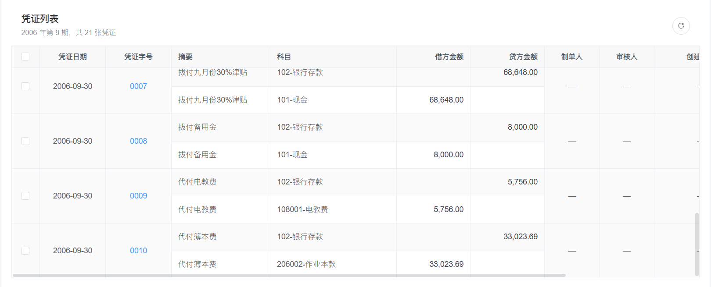
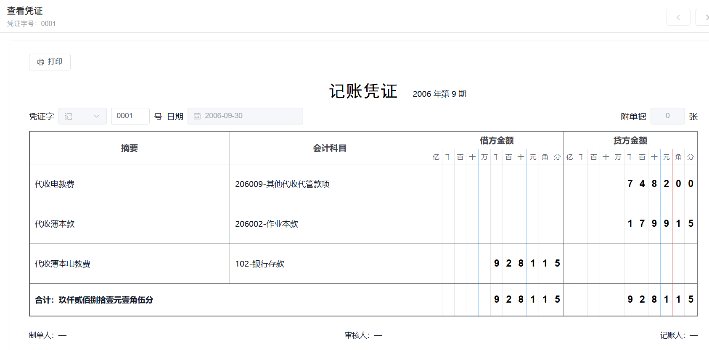
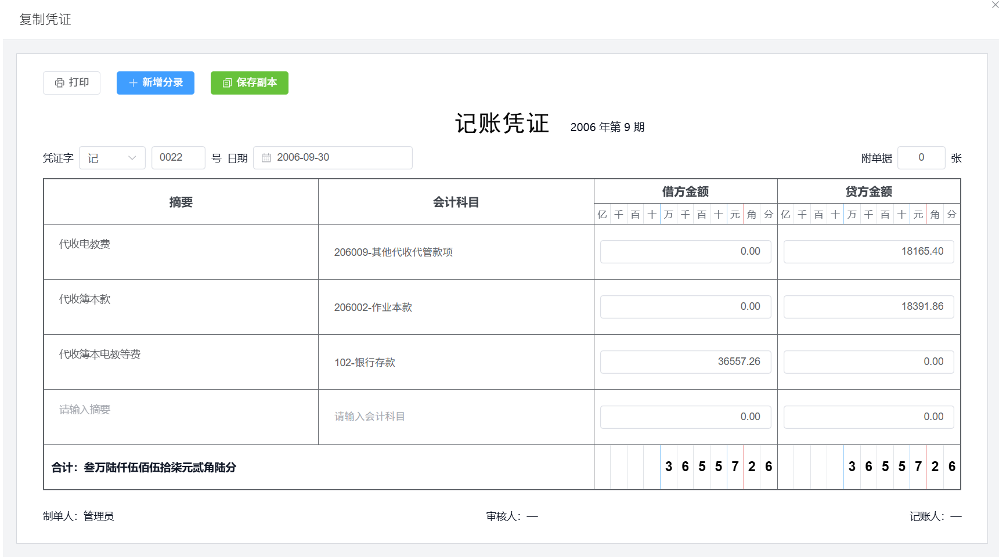

优化凭证查询模块。该模块需要展示一个会计期间内的凭证分录，并提供查看、复制和删除等操作。

后端列表接口返回的是“凭证分录”数据，同一张凭证会对应多条记录。例如凭证字号 `0001` 包含三条分录，接口会返回三行相同凭证字号的数据。因此，本周工作的重点不仅是调整页面样式，还包括将分录数据重新组织成凭证数据、合并表格行、设计独立查看页面，以及处理上一张和下一张凭证的切换。

经过几轮需求调整后，最终完成了以下内容：

1. 相同“凭证字号”的公共列合并显示
2. 操作列改为“查看”“复制”“删除”文字按钮
3. 新增可复用的记账凭证展示组件
4. 查看凭证由弹窗改为独立路由页面
5. 复用原有列表接口，不新增后端详情接口
6. 详情页支持上一张、下一张凭证切换
7. 表格纵向、横向滚动条统一放在查询页面内部
8. 取消操作列固定定位
9. 配置“凭证查询 → 查看凭证”面包屑导航

## 1. 模块概述

凭证查询模块位于 `src/views/query/voucher` 目录下，主要涉及以下文件：

| 文件 | 功能 |
| --- | --- |
| `index.vue` | 凭证查询列表页，负责条件查询、数据分组、行合并和操作入口 |
| `detail.vue` | 独立凭证查看页，负责详情展示和上一张、下一张切换 |
| `components/VoucherSheet.vue` | 记账凭证公共组件，同时支持查看模式和复制模式 |
| `src/api/query/voucher.js` | 凭证列表接口封装 |
| `src/router/index.js` | 查看凭证隐藏路由和面包屑配置 |

### 1.1 后端数据特点

后端接口返回的数据结构如下：

```json
{
  "total": 62,
  "code": 200,
  "msg": "查询成功",
  "rows": [
    {
      "account": "206009-其他代收代管款项",
      "d": 7482,
      "j": 0,
      "pzh": "0001",
      "pzrq": "2006-09-30",
      "zy": "代收电教费"
    },
    {
      "account": "206002-作业本款",
      "d": 1799.15,
      "j": 0,
      "pzh": "0001",
      "pzrq": "2006-09-30",
      "zy": "代收薄本款"
    },
    {
      "account": "102-银行存款",
      "d": 0,
      "j": 9281.15,
      "pzh": "0001",
      "pzrq": "2006-09-30",
      "zy": "代收薄本电教费"
    }
  ]
}
```

从数据中可以看出：

- `pzh`：凭证字号，同一张凭证的多条分录拥有相同的凭证字号
- `pzrq`：凭证日期
- `zy`：摘要
- `account`：会计科目
- `j`：借方金额
- `d`：贷方金额

后端返回的 `total` 是分录数量，而页面需要按“凭证”进行展示和分页。因此，前端需要先按照 `pzh` 对分录进行分组，再计算实际的凭证数量。

### 1.2 最终页面流程

```text
index.vue（凭证查询列表）
    ↓ 调用 listVoucher
按 pzh 对 rows 分组
    ↓
表格合并公共列
    ↓ 点击“查看”
通过路由状态携带当前凭证列表
    ↓
detail.vue（查看凭证）
    ↓
点击左右箭头切换上一张/下一张
```

刷新详情页面时，路由状态可能不存在，因此增加了回退流程：

```text
detail.vue 页面刷新
    ↓
读取路由中的单位、年度、期间和凭证字号
    ↓
再次调用 listVoucher
    ↓
按 pzh 分组并恢复凭证顺序
    ↓
定位当前凭证
```

---

## 2. 凭证查询列表页

### 2.1 查询条件

查询页面提供以下条件：

| 查询项 | 字段 | 说明 |
| --- | --- | --- |
| 单位代码 | `dwdm` | 查询指定单位的数据 |
| 会计年度 | `year` | 查询指定年度 |
| 会计期间 | `month` | 查询指定月份 |
| 凭证字号 | `pzh` | 在前端分组结果中筛选凭证 |

查询参数初始化如下：

```js
const defaultQuery = {
  pageNum: 1,
  pageSize: 10,
  dwdm: "1000",
  year: "2006",
  month: 9,
  pzh: ""
}

const queryParams = reactive({ ...defaultQuery })
```

列表接口仍然使用原有的 `listVoucher`：

```js
export function listVoucher(query) {
  return request({
    url: '/voucher/list',
    method: 'get',
    params: query
  })
}
```

为了在前端完成凭证分组和分页，查询时一次获取当前期间的全部分录：

```js
async function getList() {
  loading.value = true
  try {
    const response = await listVoucher({
      pageNum: 1,
      pageSize: 10000,
      dwdm: queryParams.dwdm,
      year: queryParams.year,
      month: queryParams.month
    })
    sourceRows.value = Array.isArray(response.rows) ? response.rows : []
    tableRef.value?.clearSelection()
  } finally {
    loading.value = false
  }
}
```

### 2.2 按凭证字号分组

接口返回的是分录数组，而列表页面的操作对象是一整张凭证。因此，使用 `Map` 按照 `pzh` 分组：

```js
function buildGroups(rows) {
  const groupMap = new Map()

  rows.forEach((rawRow) => {
    const row = normalizeEntry(rawRow)
    const key = String(row.pzh)

    if (!groupMap.has(key)) {
      groupMap.set(key, {
        key,
        pzh: row.pzh,
        pzrq: row.pzrq,
        maker: firstValue(row, ["maker", "zdr", "creatorName", "createBy"]),
        reviewer: firstValue(row, ["reviewer", "shr", "reviewerName"]),
        bookkeeper: firstValue(row, ["bookkeeper", "jzr", "bookkeeperName"]),
        createTime: firstValue(row, ["createTime", "createdAt"]),
        attachmentCount: Number(
          firstValue(row, ["attachmentCount", "fjzs"], 0)
        ),
        entries: []
      })
    }

    groupMap.get(key).entries.push(row)
  })

  return Array.from(groupMap.values())
}
```

分组后的数据结构如下：

```js
{
  key: "0001",
  pzh: "0001",
  pzrq: "2006-09-30",
  maker: "—",
  reviewer: "—",
  bookkeeper: "—",
  attachmentCount: 0,
  entries: [
    {
      zy: "代收电教费",
      account: "206009-其他代收代管款项",
      j: 0,
      d: 7482
    },
    {
      zy: "代收薄本款",
      account: "206002-作业本款",
      j: 0,
      d: 1799.15
    },
    {
      zy: "代收薄本电教费",
      account: "102-银行存款",
      j: 9281.15,
      d: 0
    }
  ]
}
```

通过这种结构，可以明确区分：

- 凭证级字段：凭证字号、凭证日期、制单人、审核人等
- 分录级字段：摘要、科目、借方金额、贷方金额

### 2.3 按凭证分页

分组后使用计算属性进行凭证级分页：

```js
const total = computed(() => availableGroups.value.length)

const pageGroups = computed(() => {
  const maxPage = Math.max(
    1,
    Math.ceil(total.value / queryParams.pageSize)
  )

  if (queryParams.pageNum > maxPage) {
    queryParams.pageNum = maxPage
  }

  const start = (queryParams.pageNum - 1) * queryParams.pageSize
  return availableGroups.value.slice(
    start,
    start + queryParams.pageSize
  )
})
```

这样分页组件中的总数表示凭证数量，而不是后端返回的分录数量。

### 2.4 将凭证重新展开为表格行

Element Plus 表格仍然需要逐行数据，因此将当前页的凭证重新展开，并增加用于行合并的辅助字段：

```js
const tableRows = computed(() => {
  return pageGroups.value.flatMap((group) => {
    const groupSize = group.entries.length

    return group.entries.map((entry, index) => ({
      ...entry,
      _groupKey: group.key,
      _groupSize: groupSize,
      _groupOffset: index,
      _maker: group.maker,
      _reviewer: group.reviewer,
      _createTime: group.createTime
    }))
  })
})
```

| 辅助字段 | 作用 |
| --- | --- |
| `_groupKey` | 标识当前行属于哪一张凭证 |
| `_groupSize` | 当前凭证包含多少条分录 |
| `_groupOffset` | 当前分录在凭证中的位置 |

---

## 3. 相同凭证字号合并行

### 3.1 合并规则

参考同类系统的展示方式，同一张凭证的以下列需要纵向合并：

- 勾选框
- 凭证日期
- 凭证字号
- 制单人
- 审核人
- 创建时间
- 操作

摘要、科目、借方金额和贷方金额仍然逐条显示，因为这些字段属于不同分录。

### 3.2 `span-method` 实现

Element Plus 的 `el-table` 支持通过 `span-method` 返回每个单元格的行列合并信息：

```js
function objectSpanMethod({ row, columnIndex }) {
  const mergedColumns = [0, 1, 2, 7, 8, 9, 10]

  if (!mergedColumns.includes(columnIndex)) {
    return {
      rowspan: 1,
      colspan: 1
    }
  }

  if (row._groupOffset === 0) {
    return {
      rowspan: row._groupSize,
      colspan: 1
    }
  }

  return {
    rowspan: 0,
    colspan: 0
  }
}
```

实现思路：

1. 判断当前列是否属于需要合并的公共列
2. 如果是凭证第一条分录，`rowspan` 设置为分录数量
3. 如果不是第一条分录，返回 `rowspan: 0` 隐藏重复单元格
4. 摘要、科目和金额列始终返回普通单元格

### 3.3 整组勾选

由于勾选框也进行了行合并，用户看到的是一张凭证对应一个勾选框。点击时需要同步选中该凭证的所有分录：

```js
function handleGroupSelect(selection, row) {
  const selected = selection.some(
    (item) => getRowKey(item) === getRowKey(row)
  )

  tableRows.value
    .filter((item) => item._groupKey === row._groupKey)
    .forEach((item) => {
      tableRef.value?.toggleRowSelection(item, selected)
    })
}
```


---

## 4. 操作列优化

### 4.1 从图标改为文字按钮

原页面的操作列只显示一个编辑图标，操作含义不够直观。优化后在单元格中直接显示三个文字按钮：

```html
<div class="operation-buttons">
  <el-button link type="primary" @click="handleView(row)">
    查看
  </el-button>
  <el-button link type="warning" @click="handleCopy(row)">
    复制
  </el-button>
  <el-button link type="danger" @click="handleDelete(row)">
    删除
  </el-button>
</div>
```

| 按钮 | 颜色 | 功能 |
| --- | --- | --- |
| 查看 | 蓝色 | 跳转到独立查看凭证页面 |
| 复制 | 橙色 | 打开复制凭证编辑界面 |
| 删除 | 红色 | 确认后从当前列表移除凭证 |

### 4.2 取消操作列固定

最初操作列使用了：

```html
fixed="right"
```

当表格产生横向滚动时，固定列会覆盖部分内容，并且与参考页面的行为不一致。因此删除固定属性，让操作列和其他列一起参与横向滚动。

最终配置如下：

```html
<el-table-column
  label="操作"
  width="208"
  align="center"
  class-name="voucher-operation-column"
>
```

---

## 5. 页面滚动区域优化

### 5.1 问题现象

优化前，整个后台内容区域会出现纵向滚动条，表格本身只有横向滚动条，导致：

1. 页面标题、查询条件和分页会一起上下滚动
2. 外层页面和表格的滚动行为不统一
3. 页面底部容易被版权区域遮挡
4. 固定操作列与滚动内容的视觉关系不自然

### 5.2 外层页面固定

将凭证查询页设置为纵向 Flex 布局，并禁止外层滚动：

```scss
.voucher-query-page {
  --voucher-border-color: #e5e7eb;
  display: flex;
  flex-direction: column;
  height: 100%;
  min-height: 0;
  overflow: hidden;
  background: #f5f7fa;
}
```

### 5.3 表格区域内部滚动

表格卡片占用查询条件之外的剩余空间：

```scss
.table-card {
  display: flex;
  flex: 1 1 auto;
  flex-direction: column;
  min-height: 0;

  :deep(.el-card__body) {
    display: flex;
    flex: 1 1 auto;
    flex-direction: column;
    min-height: 0;
    padding: 0;
  }
}
```

表格外增加单独的自适应容器：

```scss
.voucher-table-wrapper {
  flex: 1 1 auto;
  min-height: 0;
}

.voucher-table {
  width: 100%;
  height: 100%;
}
```

同时为 `el-table` 设置：

```html
<el-table
  height="100%"
  class="voucher-table"
>
```

这样：

- 纵向滚动条位于表格内容区域右侧
- 横向滚动条位于表格内容区域底部
- 查询条件和分页保持在页面固定位置
- 外层后台页面不再产生额外滚动条

> 图片占位：表格内部纵向和横向滚动条效果



---

## 6. 记账凭证公共组件

为了同时支持查看凭证和复制凭证，新增了 `VoucherSheet.vue` 公共组件。

### 6.1 组件属性

```js
const props = defineProps({
  voucher: {
    type: Object,
    required: true
  },
  mode: {
    type: String,
    default: "view",
    validator: (value) => ["view", "copy"].includes(value)
  },
  canPrevious: {
    type: Boolean,
    default: false
  },
  canNext: {
    type: Boolean,
    default: false
  },
  showNavigation: {
    type: Boolean,
    default: true
  }
})
```

| 属性 | 说明 |
| --- | --- |
| `voucher` | 当前凭证数据 |
| `mode` | `view` 为只读查看，`copy` 为复制编辑 |
| `canPrevious` | 是否允许切换上一张 |
| `canNext` | 是否允许切换下一张 |
| `showNavigation` | 是否在凭证组件内部显示导航按钮 |

### 6.2 查看模式与复制模式

通过计算属性判断组件模式：

```js
const isCopyMode = computed(() => props.mode === "copy")
```

查看模式下：

- 凭证字号只读
- 凭证日期只读
- 摘要和科目以文字展示
- 借贷金额按金额位数表格展示

复制模式下：

- 可以修改凭证字号和日期
- 可以编辑摘要、科目和借贷金额
- 可以新增或移除分录
- 可以保存副本到当前列表

### 6.3 金额位数展示

参考会计凭证样式，金额区域划分为：

```js
const moneyLabels = [
  "亿", "千", "百", "十",
  "万", "千", "百", "十",
  "元", "角", "分"
]
```

金额转换函数：

```js
function moneyDigits(value) {
  const amount = Number(value || 0)
  if (!amount) {
    return Array(11).fill("")
  }

  const cents = Math.round(amount * 100)
  return String(cents)
    .slice(-11)
    .padStart(11, " ")
    .split("")
    .map((digit) => digit.trim())
}
```

这样可以将 `9281.15` 拆分到“千、百、十、元、角、分”对应的格子中，更接近纸质记账凭证。

### 6.4 借贷合计

```js
const debitTotal = computed(() =>
  form.entries.reduce(
    (total, entry) => total + Number(entry.j || 0),
    0
  )
)

const creditTotal = computed(() =>
  form.entries.reduce(
    (total, entry) => total + Number(entry.d || 0),
    0
  )
)
```

复制保存前需要验证借贷金额是否平衡：

```js
if (Math.abs(debitTotal - creditTotal) > 0.005) {
  proxy.$modal.msgWarning("借贷金额不平衡，请核对后再保存")
  return
}
```

> 图片占位：查看凭证页面



> 图片占位：复制凭证页面



---

## 7. 查看凭证独立路由

### 7.1 从弹窗改为独立页面

第一版查看凭证使用 `el-dialog` 弹窗。后续需求要求取消弹窗，改为路由跳转并配置面包屑。

独立页面的优点：

1. 查看凭证拥有完整页面空间
2. 浏览器地址可以表示当前凭证
3. 页面刷新后可以重新恢复数据
4. 面包屑和标签页可以显示当前所在位置
5. 更适合后续增加打印、附件等功能

### 7.2 路由配置

新增隐藏路由：

```js
{
  path: '/voucher-detail',
  component: Layout,
  hidden: true,
  redirect: '/query/voucher',
  meta: {
    title: '凭证查询'
  },
  children: [
    {
      path: ':pzh',
      component: () => import('@/views/query/voucher/detail'),
      name: 'VoucherDetail',
      meta: {
        title: '查看凭证',
        activeMenu: '/query/voucher',
        noCache: true
      }
    }
  ]
}
```

配置说明：

| 配置项 | 作用 |
| --- | --- |
| `hidden: true` | 不在侧边栏中增加新的菜单 |
| `:pzh` | 使用凭证字号作为路由参数 |
| `title: 查看凭证` | 设置标签页和面包屑标题 |
| `activeMenu` | 查看详情时仍高亮“凭证查询”菜单 |
| `noCache` | 切换凭证时使用最新路由数据 |

最终面包屑为：

```text
首页 / 凭证查询 / 查看凭证
```

其中“凭证查询”可以返回列表页面。

### 7.3 为什么使用凭证字号

最初计划通过凭证 ID 请求详情，但实际列表接口返回的数据中没有独立的凭证 ID，只有：

- `pzh`
- `pzrq`
- `zy`
- `account`
- `j`
- `d`

同一期间内，`pzh` 可以标识一张凭证，因此最终使用凭证字号作为路由参数：

```text
/voucher-detail/0001
```

这避免了为了详情页额外修改后端接口。

---

## 8. 复用列表数据实现详情跳转

### 8.1 跳转时传递查询上下文

点击查看时，路由参数携带凭证字号，查询参数携带单位、年度和期间：

```js
function handleView(row) {
  const group = groupFromRow(row)
  if (!group) return

  router.push({
    name: "VoucherDetail",
    params: {
      pzh: group.pzh
    },
    query: {
      dwdm: queryParams.dwdm,
      year: queryParams.year,
      month: queryParams.month
    },
    state: {
      vouchers: cloneGroup(availableGroups.value)
    }
  })
}
```

路由中各部分的作用：

| 数据 | 作用 |
| --- | --- |
| `params.pzh` | 标识当前查看的凭证 |
| `query.dwdm` | 页面刷新时重新查询单位数据 |
| `query.year` | 页面刷新时重新查询年度数据 |
| `query.month` | 页面刷新时重新查询期间数据 |
| `state.vouchers` | 正常跳转时直接复用列表页已经整理好的凭证数据 |

### 8.2 优先使用路由状态

正常从列表页进入详情页时，可以直接从浏览器历史状态中读取凭证列表：

```js
function voucherListFromRouteState() {
  const stateList = window.history.state?.vouchers

  if (!Array.isArray(stateList) || !stateList.length) {
    return []
  }

  return stateList.map(normalizeVoucher)
}
```

这样点击查看时不会重复请求接口，页面可以立即显示。

### 8.3 刷新页面时回退到列表接口

如果用户刷新页面，路由状态可能不存在。这时根据路由中的查询条件重新调用 `listVoucher`：

```js
const response = await listVoucher({
  pageNum: 1,
  pageSize: 10000,
  dwdm,
  year,
  month
})

const rows = Array.isArray(response.rows)
  ? response.rows
  : []

voucherList.value = buildVoucherList(rows)
selectVoucher(pzh)
```

这种设计兼顾了两种场景：

1. 正常跳转：复用列表数据，不重复请求
2. 页面刷新：复用原列表接口，恢复详情数据

---

## 9. 上一张和下一张凭证

### 9.1 当前凭证索引

详情页保存完整的凭证列表，并根据路由中的 `pzh` 计算当前索引：

```js
const currentIndex = computed(() =>
  voucherList.value.findIndex(
    (item) =>
      String(item.pzh) === String(route.params.pzh)
  )
)
```

### 9.2 按钮禁用状态

```js
const canPrevious = computed(
  () => currentIndex.value > 0
)

const canNext = computed(
  () =>
    currentIndex.value >= 0 &&
    currentIndex.value < voucherList.value.length - 1
)
```

规则如下：

- 当前是第一张凭证：禁用左箭头
- 当前是最后一张凭证：禁用右箭头
- 中间凭证：左右箭头都可以点击

### 9.3 切换凭证

```js
function showAdjacentVoucher(step) {
  const target =
    voucherList.value[currentIndex.value + step]

  if (!target) return

  router.replace({
    name: "VoucherDetail",
    params: {
      pzh: target.pzh
    },
    query: route.query,
    state: {
      vouchers: JSON.parse(
        JSON.stringify(voucherList.value)
      )
    }
  })
}
```

这里使用 `router.replace`，而不是 `router.push`：

- `replace` 会更新当前详情地址
- 不会为每一次左右切换增加新的浏览历史
- 浏览器返回时可以直接回到凭证查询页

按钮模板：

```html
<div class="detail-navigation">
  <el-button
    icon="ArrowLeft"
    :disabled="!canPrevious"
    title="上一张凭证"
    @click="showAdjacentVoucher(-1)"
  />
  <el-button
    icon="ArrowRight"
    :disabled="!canNext"
    title="下一张凭证"
    @click="showAdjacentVoucher(1)"
  />
</div>
```

---

## 10. 复制凭证

复制凭证继续使用弹窗，因为复制过程属于临时编辑操作，不需要生成新的详情路由。

### 10.1 生成新凭证字号

```js
function incrementVoucherNumber(currentNumber) {
  const match = String(currentNumber || "")
    .match(/^(.*?)(\d+)$/)

  const prefix = match?.[1] || ""
  const width = match?.[2]?.length || 4

  const matchingNumbers = availableGroups.value
    .map((group) =>
      String(group.pzh).match(/^(.*?)(\d+)$/)
    )
    .filter(
      (item) => item && item[1] === prefix
    )
    .map((item) => Number(item[2]))

  const nextNumber =
    Math.max(
      Number(match?.[2] || 0),
      ...matchingNumbers,
      0
    ) + 1

  return `${prefix}${String(nextNumber).padStart(
    width,
    "0"
  )}`
}
```

例如：

```text
当前凭证字号：0009
复制后凭证字号：0010
```

### 10.2 复制数据

```js
function handleCopy(row) {
  const group = groupFromRow(row)
  if (!group) return

  const copy = cloneGroup(group)
  copy.pzh = incrementVoucherNumber(group.pzh)
  copy.key = copy.pzh
  copy.reviewer = "—"
  copy.bookkeeper = "—"

  copy.entries = copy.entries.map((entry) => ({
    ...entry,
    pzh: copy.pzh
  }))

  copyVoucher.value = copy
  copyVisible.value = true
}
```

### 10.3 保存前校验

保存副本前检查：

1. 凭证字号不能为空
2. 至少保留一条有效分录
3. 新凭证字号不能重复
4. 借方金额和贷方金额必须平衡

这些校验可以避免在当前列表中产生明显错误的凭证数据。

---

---

---
`这一周把一条条凭证分录整理成了一张张可以查看、复制和切换的凭证，感觉自己对前端数据建模和路由状态的理解又深入了一些。`
