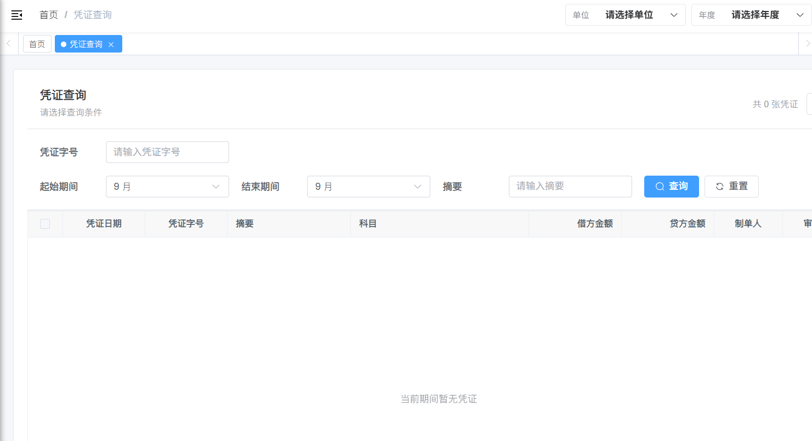
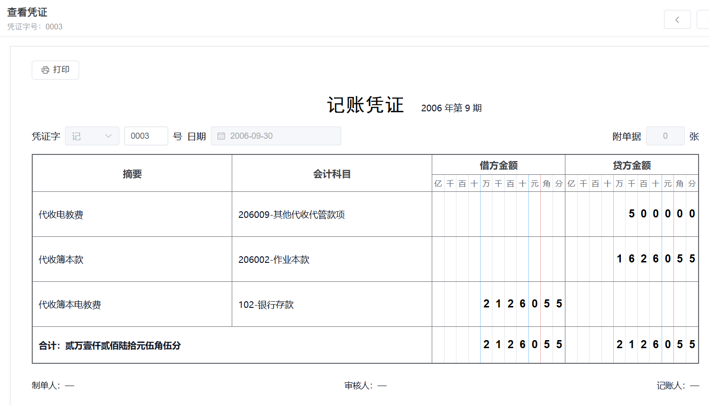
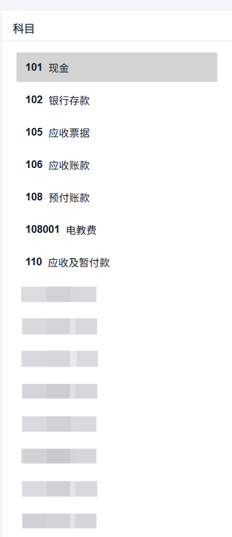
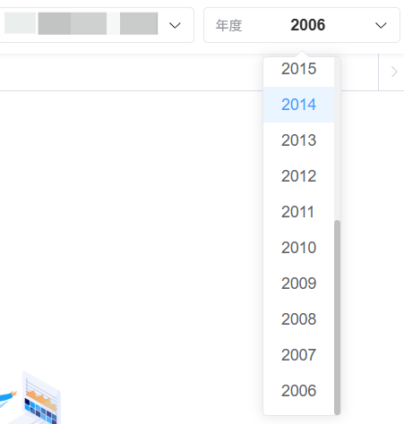
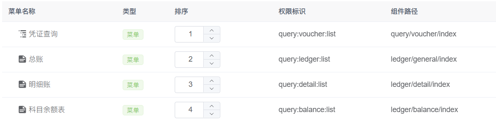

围绕凭证查询系统继续做功能完善和权限逻辑优化。涉及查询表单、账簿页面、导航栏上下文、动态路由、菜单权限、用户角色授权以及管理员默认账套等多个部分。

这轮需求的核心可以概括为一句话：

> 让凭证查询和账簿查询真正按照“单位 + 年度 + 用户权限”运行，并且让页面结构、路由结构和菜单权限保持一致。

最终完成的主要内容包括：

1. 优化凭证查询表单结构和筛选逻辑
2. 新增并拆分账簿管理下的三个页面：总账、明细账、科目余额表
3. 调整导航栏右上角单位和年度选择器
4. 接入当前登录用户负责单位接口，实现不同用户看到不同单位
5. 管理员默认拥有所有单位查看权限
6. 管理员首次进入系统默认渲染 `1000 + 2006` 数据库状态
7. 将凭证查询、总账、明细账、科目余额表归入菜单管理动态路由
8. 批量配置已有用户角色权限，使所有已有用户可以访问四个业务页面
9. 优化数据库不存在时的错误处理，不再弹出全局错误消息，而是在页面中渲染 404
10. 修复导航栏下拉框抖动和下拉列表过高的问题

---

## 1. 凭证查询模块优化

### 1.1 模块概述

凭证查询模块主要位于：

```text
src/views/query/voucher
```

本轮继续在上一周的基础上优化查询体验和页面结构，主要涉及以下文件：

| 文件 | 功能 |
| --- | --- |
| `src/views/query/voucher/index.vue` | 凭证查询列表页，负责查询表单、分组表格、查看入口和 404 状态渲染 |
| `src/views/query/voucher/detail.vue` | 查看凭证详情页，负责凭证展示和上一张/下一张切换 |
| `src/views/query/voucher/components/VoucherSheet.vue` | 记账凭证展示组件 |
| `src/api/query/voucher.js` | 凭证查询接口封装 |

### 1.2 查询表单结构调整

凭证查询表单从原来的点击日期文本框展开查询面板，调整为和账簿管理页面一致的“标题 + 查询表单 + 表格”结构。

最终保留的查询条件主要包括：

| 查询条件 | 字段 | 说明 |
| --- | --- | --- |
| 凭证字号 | `pzh` | 输入凭证字号进行查询 |
| 起始期间 | `startMonth` | 下拉选择起始会计期间 |
| 结束期间 | `endMonth` | 下拉选择结束会计期间 |
| 摘要 | `zy` | 支持按摘要模糊查询 |

单位代码和会计年度不再放在查询表单中，而是统一由导航栏右上角的全局上下文提供：

```js
function buildVoucherQuery({ withPagination = true } = {}) {
  return compactQuery({
    ...(withPagination ? { pageNum: 1, pageSize: 10000 } : {}),
    dwdm: accountContextStore.dwdm,
    dwmc: accountContextStore.dwmc,
    year: accountContextStore.year,
    ...periodQueryOf(),
    pzh: String(queryParams.pzh || "").trim(),
    zy: String(queryParams.zy || "").trim()
  })
}
```

这样做的好处是：

- 四个业务模块统一使用同一个单位和年度上下文
- 查询表单更简洁，不再重复出现单位代码和会计年度
- 后续切换单位或年度时，页面可以自动刷新当前模块数据

### 1.3 查询请求方式

凭证查询仍然复用已有后端接口：

```js
export function listVoucher(query) {
  return request({
    url: '/voucher/list',
    method: 'get',
    params: query,
    hideErrorMessage: true
  })
}
```

这里增加了 `hideErrorMessage: true`，用于配合数据库不存在时的局部 404 页面。

当选择的单位和年度对应数据库不存在时，不再让全局拦截器弹出红色错误消息，而是在页面内部捕获错误：

```js
function isDatabaseMissingError(error) {
  const message = String(error?.message || error || "")
  return /数据库|不存在|Unknown database|doesn'?t exist|404/i.test(message)
}
```

如果判断为数据库不存在，则设置：

```js
databaseMissing.value = true
```

然后页面渲染：

```html
<Error404 v-if="databaseMissing" class="voucher-error-page" />
<div v-else class="voucher-table-wrapper">
  <!-- 凭证表格 -->
</div>
```

这样用户看到的是一个明确的 404 页面，而不是突兀的全局错误弹窗。

### 1.4 首次进入不自动查询

普通用户首次进入系统时，默认不选中单位和年度。凭证查询页也因此不能立即发起查询，否则会出现参数缺失。

处理方式是增加全局上下文判断：

```js
const hasContext = computed(() =>
  Boolean(accountContextStore.dwdm && accountContextStore.year)
)
```

只有当单位和年度都选中后才查询：

```js
if (hasContext.value) {
  getList({ silent: true })
}
```

同时监听单位和年度变化：

```js
watch(
  () => [accountContextStore.dwdm, accountContextStore.year],
  () => {
    queryParams.pageNum = 1
    sourceRows.value = []
    databaseMissing.value = false
    if (hasContext.value) {
      getList({ silent: true })
    }
  }
)
```

这样页面不会在没有上下文时误请求，也不会频繁弹出“请选择单位和年度”的提示。
  


---

## 2. 查看凭证页面布局优化

查看凭证页面上一轮已经从弹窗改成独立路由页面，本轮主要继续调整布局，避免容器缩小时标题被左侧字段挤压。

### 2.1 问题现象

页面中“记账凭证”主标题需要保持居中，副标题日期需要和主标题同行展示。但原布局中，左侧凭证字、凭证号、日期输入框占用空间较大，导致主标题被挤压。

### 2.2 优化思路

优化后将标题区域看作一个独立的中间块：

- 主标题“记账凭证”保持视觉居中
- 副标题日期和主标题同行展示
- 左右两侧元信息不再影响标题位置
- 日期框长度缩小，避免小容器中撑开布局

布局上更倾向使用网格或弹性布局将页面划分为：

```text
左侧凭证信息     中间标题区域     右侧附单据信息
```

这样容器变窄时，标题区域仍然有独立空间，不会因为左侧字段过长而偏移。
 


---

## 3. 账簿管理模块

### 3.1 模块拆分

本轮新增并拆分了账簿管理相关页面。最初设计为一个“账簿管理”模块下包含三个子页面，后续根据菜单管理和动态路由需求，将三个页面独立成单独模块：

| 页面 | 路径 | 组件 |
| --- | --- | --- |
| 总账 | `ledger/general` | `ledger/general/index` |
| 明细账 | `ledger/detail` | `ledger/detail/index` |
| 科目余额表 | `ledger/balance` | `ledger/balance/index` |

对应目录结构如下：

```text
src/views/ledger
├── balance
│   └── index.vue
├── components
│   └── LedgerQueryPage.vue
├── detail
│   └── index.vue
└── general
    └── index.vue
```

其中 `LedgerQueryPage.vue` 是公共查询页组件，三个页面通过传入不同的接口和表格列配置实现复用。

### 3.2 公共组件设计

公共组件的核心属性如下：

```js
const props = defineProps({
  title: {
    type: String,
    required: true
  },
  request: {
    type: Function,
    required: true
  },
  columns: {
    type: Array,
    required: true
  },
  requireAccount: {
    type: Boolean,
    default: false
  },
  defaultAccountCode: {
    type: String,
    default: ""
  },
  showAccountOverview: {
    type: Boolean,
    default: false
  }
})
```

| 属性 | 说明 |
| --- | --- |
| `title` | 页面标题，如总账、明细账 |
| `request` | 当前页面使用的查询接口 |
| `columns` | 表格列配置 |
| `requireAccount` | 是否必须选择科目 |
| `defaultAccountCode` | 默认科目代码 |
| `showAccountOverview` | 是否展示右侧科目总览列表 |

三个页面只需要维护自己的列配置：

```js
<ledger-query-page
  title="总账"
  :request="listGeneralLedger"
  :columns="columns"
  empty-text="暂无总账数据"
/>
```

这种写法减少了重复代码，也方便后续继续扩展其他账簿页面。

### 3.3 明细账右侧科目列表

明细账页面参考旧系统样式，在右侧增加科目代码和科目名称总览列表。用户点击某个科目后，自动带上科目代码查询明细账。

科目列表接口为：

```js
export function listLedgerAccounts(query) {
  return request({
    url: '/voucher/km/list',
    method: 'get',
    params: query,
    hideErrorMessage: true
  })
}
```

请求参数由全局上下文提供：

```js
const response = await listLedgerAccounts({
  dwdm: accountContextStore.dwdm,
  year: accountContextStore.year,
  pageNum: 1,
  pageSize: 10000
})
```

返回数据中科目名称字段为 `kmmc`，前端进行标准化处理：

```js
function normalizeAccount(account) {
  return {
    ...account,
    kmdm: String(account?.kmdm || account?.accountCode || ""),
    kmmc: account?.kmmc || account?.accountName || ""
  }
}
```

默认展示科目代码 `101` 的明细账：

```html
<ledger-query-page
  title="明细账"
  :request="listDetailLedger"
  :columns="columns"
  require-account
  show-account-overview
  default-account-code="101"
/>
```



### 3.4 账簿接口封装

账簿接口统一封装在：

```text
src/api/ledger/index.js
```

| 函数 | 接口 | 说明 |
| --- | --- | --- |
| `listGeneralLedger` | `/voucher/generalLedger/list` | 查询总账 |
| `listDetailLedger` | `/voucher/detailLedger/list` | 查询明细账 |
| `listAccountBalance` | `/voucher/accountBalance/list` | 查询科目余额表 |
| `listLedgerAccounts` | `/voucher/km/list` | 查询科目列表 |

这些接口都增加了：

```js
hideErrorMessage: true
```

原因和凭证查询一样：当单位年度对应数据库不存在时，由页面内部渲染 404，而不是使用全局弹窗。

---

## 4. 导航栏单位与年度上下文

### 4.1 从页面查询条件中抽离公共参数

凭证查询、总账、明细账、科目余额表四个页面都需要：

- 单位代码 `dwdm`
- 单位名称 `dwmc`
- 会计年度 `year`

如果每个页面都放一套单位和年度查询条件，不仅重复，而且容易造成状态不一致。因此本轮将这两个公共条件抽离到导航栏右上角。

涉及文件：

| 文件 | 功能 |
| --- | --- |
| `src/layout/components/Navbar.vue` | 展示单位和年度下拉框 |
| `src/store/modules/accountContext.js` | 保存当前单位和年度上下文 |
| `src/api/accountContext.js` | 封装单位和年度相关接口 |

### 4.2 状态管理

`accountContext` store 的核心状态如下：

```js
state: () => ({
  unitOptions: [],
  yearOptions: [],
  dwdm: '',
  dwmc: '',
  year: '',
  loadingUnits: false,
  loadingYears: false
})
```

| 状态 | 说明 |
| --- | --- |
| `unitOptions` | 当前用户可选择的单位列表 |
| `yearOptions` | 当前单位可选择的年度列表 |
| `dwdm` | 当前单位代码 |
| `dwmc` | 当前单位名称 |
| `year` | 当前会计年度 |
| `loadingUnits` | 单位加载状态 |
| `loadingYears` | 年度加载状态 |

普通用户首次进入系统时，默认不选中单位和年度：

```js
dwdm: '',
dwmc: '',
year: ''
```

这样可以避免在用户还没有选择上下文时误请求后端。

### 4.3 年度列表返回全部数据

年度接口默认只返回 10 条数据，原因是若依分页默认值生效。原请求只传了：

```js
{ dwdm: this.dwdm }
```

优化后改为：

```js
const response = await listYears({
  dwdm: this.dwdm,
  pageNum: 1,
  pageSize: 10000
})
```

这样年度下拉框可以拿到完整年份列表，不会只展示前 10 条。

### 4.4 下拉框抖动优化

单位名称较长时，点击选择后会撑开导航栏，导致页面抖动。优化方式是：

1. 单位和年度按钮固定宽度
2. 文本超出显示省略号
3. 下拉列表限制高度
4. 下拉项过多时内部滚动

核心样式如下：

```scss
.context-button {
  display: inline-flex;
  align-items: center;
  justify-content: space-between;
  height: 32px;
  box-sizing: border-box;
  overflow: hidden;
}

.unit-context-button {
  width: 176px;
}

.context-value {
  flex: 1 1 auto;
  overflow: hidden;
  min-width: 0;
  text-overflow: ellipsis;
  white-space: nowrap;
}

:global(.account-context-dropdown .el-dropdown-menu) {
  max-height: 320px;
  overflow-y: auto;
  overflow-x: hidden;
}
```
 


---

## 5. 用户单位权限

### 5.1 普通用户单位权限

后端新增接口：

```text
GET /voucher/unit/current-user/list
```

用于获取当前登录用户负责的单位列表。这个接口不需要前端传 `userid`，而是通过登录态中的 token 判断当前用户。

前端封装如下：

```js
export function listCurrentUserUnits() {
  return request({
    url: '/voucher/unit/current-user/list',
    method: 'get'
  })
}
```

普通用户加载单位时调用：

```js
const response = await listCurrentUserUnits()
```

这样不同账号登录后，单位下拉框中看到的单位列表会不同。

### 5.2 单位字段兼容

为了兼容不同接口返回结构，前端对单位数据做了标准化处理：

```js
function normalizeUnit(unit) {
  if (typeof unit === 'string' || typeof unit === 'number') {
    const value = String(unit)
    const [code, ...nameParts] = value.split('-')
    return {
      dwdm: code || value,
      dwmc: nameParts.join('-') || value
    }
  }
  return {
    ...unit,
    dwdm: String(unit?.dwdm || unit?.unitCode || unit?.code || unit?.value || ''),
    dwmc:
      unit?.dwmc ||
      unit?.unitName ||
      unit?.name ||
      unit?.label ||
      unit?.dwdm ||
      unit?.unitCode ||
      unit?.code ||
      unit?.value ||
      ''
  }
}
```

支持的返回结构包括：

```js
{ dwdm, dwmc }
{ code, name }
{ value, label }
"1000-单位名称"
"1000"
```

### 5.3 登出清理上下文

为了避免切换账号后仍然残留上一个账号的单位列表，登出时清空 `accountContext`：

```js
useAccountContextStore().resetContext()
```

对应方法：

```js
resetContext() {
  this.unitOptions = []
  this.loadingUnits = false
  this.loadingYears = false
  this.clearContext()
}
```

这一步虽然很小，但对权限类功能很重要。否则在同一个浏览器会话中切换用户时，可能短暂显示上一个用户的单位数据。

---

## 6. 管理员默认账套逻辑

### 6.1 需求变化

后续需求调整为：

> 当登录态为管理员权限时，默认拥有所有单位的查看权限，并且默认渲染 `1000 + 2006` 单位数据库状态。

这里需要区分普通用户和管理员：

| 用户类型 | 单位来源 | 是否默认选中 |
| --- | --- | --- |
| 普通用户 | `/voucher/unit/current-user/list` | 不默认选中 |
| 管理员 | `/voucher/unit/list` | 默认选中 `1000 / 2006` |

### 6.2 管理员判断

项目中已有权限工具约定：

- 角色包含 `admin` 表示管理员
- 权限包含 `*:*:*` 表示拥有全部权限

因此在导航栏中计算：

```js
const isAdminUser = computed(() => {
  return userStore.roles.includes('admin') ||
    userStore.permissions.includes('*:*:*')
})
```

初始化上下文时传入：

```js
accountContextStore.initialize({
  isAdmin: isAdminUser.value
})
```

### 6.3 管理员加载全部单位

API 封装：

```js
export function listUnits(query) {
  return request({
    url: '/voucher/unit/list',
    method: 'get',
    params: query
  })
}
```

管理员加载单位时：

```js
const response = isAdmin
  ? await listUnits({ pageNum: 1, pageSize: 10000 })
  : await listCurrentUserUnits()
```

### 6.4 默认选中 1000 和 2006

在 `accountContext` 中定义默认值：

```js
const ADMIN_DEFAULT_UNIT_CODE = '1000'
const ADMIN_DEFAULT_YEAR = '2006'
```

管理员加载单位后，如果当前没有选中单位，则自动选中默认单位：

```js
const defaultUnit =
  units.find((unit) => unit.dwdm === ADMIN_DEFAULT_UNIT_CODE) || units[0]

if (defaultUnit) {
  this.dwdm = defaultUnit.dwdm
  this.dwmc = defaultUnit.dwmc
  this.year = ADMIN_DEFAULT_YEAR
}
```

这样管理员登录后页面会自动进入：

```text
dwdm = 1000
year = 2006
```

也就是默认渲染 `10002006` 单位数据库状态。

---

## 7. 动态路由与菜单权限

### 7.1 项目动态路由机制

本项目使用若依前端的动态路由机制。登录后在 `src/permission.js` 中执行：

```js
const accessRoutes = await usePermissionStore().generateRoutes()
```

`generateRoutes` 内部请求后端：

```js
getRouters()
```

也就是：

```text
GET /getRouters
```

后端返回菜单路由后，前端通过 `filterAsyncRouter` 转换组件：

```js
function filterAsyncRouter(asyncRouterMap, lastRouter = false, type = false) {
  return asyncRouterMap.filter(route => {
    if (route.component) {
      if (route.component === 'Layout') {
        route.component = Layout
      } else if (route.component === 'ParentView') {
        route.component = ParentView
      } else if (route.component === 'InnerLink') {
        route.component = InnerLink
      } else {
        route.component = loadView(route.component)
      }
    }
    return true
  })
}
```

组件路径通过 `loadView` 映射到 `src/views`：

```js
export const loadView = (view) => {
  let res
  for (const path in modules) {
    const dir = path.split('views/')[1].split('.vue')[0]
    if (dir === view) {
      res = () => modules[path]()
    }
  }
  return res
}
```

所以菜单管理中填写：

```text
ledger/general/index
```

就会映射到：

```text
src/views/ledger/general/index.vue
```

### 7.2 四个业务页面归入菜单管理

为了和凭证查询保持一致，总账、明细账、科目余额表不再写入 `constantRoutes`，而是统一通过菜单管理分配。

菜单配置如下：

| 菜单名称 | 路由地址 | 组件路径 | 权限标识 |
| --- | --- | --- | --- |
| 凭证查询 | `query/voucher` | `query/voucher/index` | `query:voucher:list` |
| 总账 | `ledger/general` | `ledger/general/index` | `query:ledger:list` |
| 明细账 | `ledger/detail` | `ledger/detail/index` | `query:detail:list` |
| 科目余额表 | `ledger/balance` | `ledger/balance/index` | `query:balance:list` |

前端只保留了查看凭证详情页的隐藏路由：

```js
{
  path: '/voucher-detail',
  component: Layout,
  hidden: true,
  redirect: '/query/voucher',
  children: [
    {
      path: ':pzh',
      component: () => import('@/views/query/voucher/detail'),
      name: 'VoucherDetail',
      meta: {
        title: '查看凭证',
        activeMenu: '/query/voucher',
        noCache: true
      }
    }
  ]
}
```

原因是查看凭证属于凭证查询的内部详情页，不应该作为菜单项分配。

### 7.3 批量配置已有用户权限

角色管理中已有两个角色：

| 角色 ID | 角色名称 | 权限字符 |
| --- | --- | --- |
| `1` | 超级管理员 | `admin` |
| `2` | 普通角色 | `common` |

本轮直接通过后端接口完成权限数据调整：

1. 将普通角色 `roleId=2` 的菜单权限补齐为：

```text
2000, 2001, 2002, 2003
```

2. 检查已有用户授权情况：

```text
已有用户总数：125
超级管理员：admin，默认全部权限
普通角色已授权用户：124
剩余未授权用户：仅 admin
```

也就是说，已有用户都可以访问：

```text
凭证查询
总账
明细账
科目余额表
```



---

## 8. 全局错误处理优化

### 8.1 原问题

当用户选择某个单位和年度后，前端会根据两者拼接查询对应数据库。如果该数据库不存在，后端会返回错误。

优化前，错误会被全局请求拦截器捕获并弹出：

```js
ElMessage({ message: msg, type: 'error' })
```

这类弹窗的问题是：

1. 错误信息对普通用户不友好
2. 每次切换单位或年度都可能弹出
3. 用户无法明确知道当前页面没有对应数据库

### 8.2 增加静默错误配置

在 `src/utils/request.js` 中支持：

```js
hideErrorMessage: true
```

当接口配置了该字段时，全局拦截器不再弹出错误消息：

```js
const hideErrorMessage =
  res.config?.hideErrorMessage === true ||
  res.config?.headers?.hideErrorMessage === true

if (code === 500) {
  if (!hideErrorMessage) {
    ElMessage({ message: msg, type: 'error' })
  }
  return Promise.reject(new Error(msg))
}
```

网络错误分支同样处理：

```js
if (!hideErrorMessage) {
  ElMessage({
    message: message,
    type: 'error',
    duration: 5 * 1000
  })
}
```

### 8.3 页面内部渲染 404

凭证查询和账簿查询页面捕获错误后，判断是否属于数据库不存在：

```js
function isDatabaseMissingError(error) {
  const message = String(error?.message || error || "")
  return /数据库|不存在|Unknown database|doesn'?t exist|404/i.test(message)
}
```

如果是，则渲染：

```html
<Error404 />
```

这样用户看到的是页面状态，而不是全局弹窗。

---

## 9. 技术要点总结

### 9.1 动态路由不等于公共路由

一开始总账、明细账、科目余额表曾经被写入 `constantRoutes`，这样虽然页面可以访问，但会绕过后端菜单管理和角色权限分配。

本轮调整后，四个业务页面都通过菜单管理返回：

```text
/getRouters -> filterAsyncRouter -> router.addRoute
```

这更符合后台权限系统的设计。

### 9.2 全局上下文减少重复查询条件

单位和年度是四个业务页面共同依赖的参数，因此放在导航栏统一管理更合适。

这样页面查询只需要关心自己的业务条件，例如：

- 凭证字号
- 摘要
- 起止期间
- 科目代码

公共条件由 `accountContextStore` 注入。

### 9.3 管理员和普通用户分流

同一个单位下拉框，在不同登录态下有不同数据来源：

```js
const response = isAdmin
  ? await listUnits({ pageNum: 1, pageSize: 10000 })
  : await listCurrentUserUnits()
```

这样既保证了管理员拥有全量查看能力，又保留了普通用户的单位权限控制。

### 9.4 页面级 404 比全局 error 更适合业务状态

数据库不存在不是前端崩溃，而是一种业务状态。将它渲染成页面状态，比弹出错误消息更稳定，也更容易让用户理解当前单位年度不可用。

### 9.5 下拉框稳定性也会影响使用体验

导航栏中的单位名称经常很长，如果不限制宽度，选择后会造成页面抖动。通过固定宽度、文本省略和下拉列表滚动，可以让导航栏交互更加稳定。

---

## 10. 本周总结

本周的工作不像上一周那样只集中在一个页面，而是从“页面展示”逐渐深入到“系统上下文”和“权限体系”。

这次最重要的收获有三点：

1. **动态路由要和菜单权限保持一致**  
   业务页面不应该随意写入公共路由，否则会绕过角色权限体系。

2. **公共参数适合抽离成全局上下文**  
   单位和年度被多个模块共享，放到导航栏统一选择，比每个页面重复维护更清晰。

3. **权限逻辑要区分普通用户和管理员**  
   普通用户只看自己负责的单位，管理员则拥有全部单位权限，并默认进入指定账套状态。

这一轮改动让我对后台系统里的“路由、菜单、角色、用户、业务查询参数”之间的关系理解更清楚了。页面功能看起来只是几个下拉框和几张表，但背后其实串起了前端路由、后端菜单、用户权限、接口参数和错误状态处理。

`这周的感觉像是在给系统补“骨架”：页面只是表面，真正要稳的是路由和权限这条主线。`
