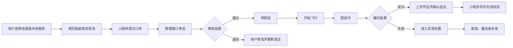

这次接触的项目不再是一个孤立的列表页，而是一套同时包含管理端和微信小程序端的低空物流系统。

刚看到需求文档里的流程图时，我的第一反应是：一张订单怎么能走出这么长的一条路？等真正开始拆页面、对接口、梳理状态后才发现，订单不是一行数据库记录，而是用户、运营人员、飞手、异常处理人员共同维护的一段履约过程。

## 1. 项目角色

系统主要分为两个前端：

| 端 | 技术栈 | 面向用户 | 主要职责 |
| --- | --- | --- | --- |
| 管理端 | Vue 3、Element Plus、Pinia、Vue Router | 运营、飞手、客服、管理员 | 审核订单、执行配送、处理异常、查看报表 |
| 小程序端 | uni-app、Vue 3、Pinia、微信原生能力 | 下单用户 | 创建订单、支付、查看轨迹、接收消息、提交反馈 |

这两个前端共享同一套业务事实：订单号、订单状态、船舶收货信息、配送凭证和异常记录必须保持一致。

## 2. 一张订单的主流程



主流程看起来是一条直线，真正开发时却要同时回答很多问题：

- 用户是否已经登录并绑定手机号？
- 快递和外卖需要填写哪些不同字段？
- 订单被退回后是新建一单，还是修改原单？
- 配送失败后原订单、异常单和重派任务怎样关联？
- 管理端改变状态后，小程序怎样及时展示？

## 3. 订单状态是双端共同语言

项目没有让页面直接到处判断后端原始状态，而是逐步建立统一的状态视图。小程序会把状态转换为视觉分组：

```js
const statusView = getOrderStatusView(order.orderStatus)

// 页面关注的是视觉和操作语义
statusView.group
statusView.label
statusView.visual
```

例如 `UNPAID`、`PENDING_AUDIT`、`WAIT_DISPATCH`、`DELIVERING`、`COMPLETED` 分别决定：

- 卡片使用什么颜色；
- 右上角显示什么状态；
- 用户能够修改、支付、取消还是查看位置；
- 管理端能够审核、开始飞行还是确认送达。

状态枚举像一套暗号。管理端说“开始飞行”，小程序就知道要展示“配送中”；管理端确认送达，小程序就切换到完成态并开放回单入口。

## 4. 异常流程不是主流程的补丁

需求文档把异常分为取消、重派和补发，这让我意识到异常不能只写成一个备注字段。

| 异常类型 | 触发场景 | 后续动作 |
| --- | --- | --- |
| 取消 | 飞行前用户取消 | 关闭订单、退款、释放运力 |
| 重派 | 配送失败但仍需配送 | 登记失败结果，重新进入配送队列 |
| 补发 | 少件、破损、错发 | 生成补发子订单并关联原订单 |

异常单需要自己的编号、状态、处理日志和权限，同时还要保留与原订单的关系。它不是主流程旁边临时贴上的便利贴，而是一条可以独立跟踪的业务支线。

## 5. 双端之间的数据边界

管理端和小程序端通过接口共享业务数据，但两个端展示的重点并不相同。

| 数据 | 管理端关注点 | 小程序端关注点 |
| --- | --- | --- |
| 订单 | 审核、履约、操作日志 | 下单、支付、进度 |
| 船舶地址 | 运力与配送可达性 | 收货信息维护 |
| 配送凭证 | 审核与留档 | 查看回单 |
| 消息 | 通知记录与发送状态 | 用户可读的订单动态 |
| 异常 | 分派、处理和关闭 | 反馈提交与结果查看 |

数据库主键主要服务于接口关联，平台订单号、异常订单号等业务编号则服务于真实业务沟通。页面设计时需要根据用户角色选择正确的信息，而不是把接口返回的所有字段原样搬上去。

## 6. 本篇总结

这套项目让我第一次比较完整地理解了“双端业务闭环”这个词。管理端不是小程序的后台表格集合，小程序也不是管理端的缩小版，它们分别承担不同角色，但共同维护同一张订单的生命周期。


`以前看到流程图只想赶紧跳过去写页面，现在会先多看两眼——那几条箭头里，通常藏着未来几天的工作量。`
