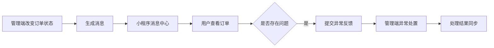

订单状态会不断变化，但用户不可能一直守在详情页刷新。消息中心负责把重要变化送到用户面前，异常反馈则让用户把问题重新送回平台。

## 1. 消息数据

站内消息主要包含：

| 字段 | 说明 |
| --- | --- |
| `notificationId` | 消息 ID |
| `orderId` | 关联订单 |
| `notificationType` | 到达、取消、异常、状态更新等类型 |
| `title` | 消息标题 |
| `content` | 消息正文 |
| `sendTime` | 发送时间 |
| `readStatus` | 已读或未读 |

消息类型通过统一配置转换为图标、标题和视觉样式。

## 2. 消息列表分页

消息接口每页加载20条。列表采用内部 `scroll-view`：

```html
<scroll-view
  scroll-y
  refresher-enabled
  @refresherrefresh="refreshMessages"
  @scrolltolower="loadMore"
>
```

交互规则如下：

```text
首次进入 -> 最新20条
下拉刷新 -> 重新加载第一页
滚动到底 -> 追加下一页20条历史消息
```

store 使用消息 ID 去重，并按发送时间倒序排列：

```js
const mergedMessages = new Map()
rows.forEach((item) => {
  mergedMessages.set(String(item.notificationId), item)
})
```

## 3. 已读状态

用户进入消息详情后，本地将消息标记为已读，并保存已读 ID。这样从详情返回列表时，未读圆点会立即消失。

```js
locallyReadIds.value.add(String(notificationId))
uni.setStorageSync('readNotificationIds', [...locallyReadIds.value])
```

## 4. 消息详情

消息详情展示类型、正文、发送时间和关联订单号。用户可以从消息直接进入订单详情。

关联关系内部使用 `orderId` 查询，页面展示平台 `orderNo`。这种处理让跳转稳定，同时避免把数据库主键当成业务编号展示。

## 5. 异常反馈表单

用户可以选择自己的订单并提交异常反馈：

```text
选择关联订单
  ↓
选择异常类型
  ↓
填写问题描述
  ↓
上传反馈图片
  ↓
提交异常单
```

异常类型包括少件、破损、错发和其他问题，并会转换为管理端能够继续处理的异常类型。

## 6. 图片上传

异常反馈先提交文本数据，得到异常记录后，再上传反馈图片并使用 `EXCEPTION_FEEDBACK` 类型关联。

上传过程中需要处理：

- 图片选择；
- 上传数量；
- 临时路径；
- token；
- 部分图片失败；
- 提交成功后的表单重置。

## 7. 异常反馈列表

反馈列表展示：

- 异常类型；
- 处理状态；
- 问题描述；
- 关联平台订单号；
- 优先级；
- 处理结果；
- 异常订单号和反馈时间。

处理状态转换为待处理、处理中、已完成和已关闭，让用户能够理解问题是否仍在跟进。

## 8. 双向信息流



消息和反馈共同形成平台与用户之间的闭环。

## 9. 本篇总结

消息中心负责把平台的变化讲给用户听，异常反馈负责把用户的问题带回平台。两边都做完整后，订单才不只是后台里不断变化的一串状态。


`消息是系统主动开口，反馈是用户举手发言。好在这次双方都没有被静音。`
