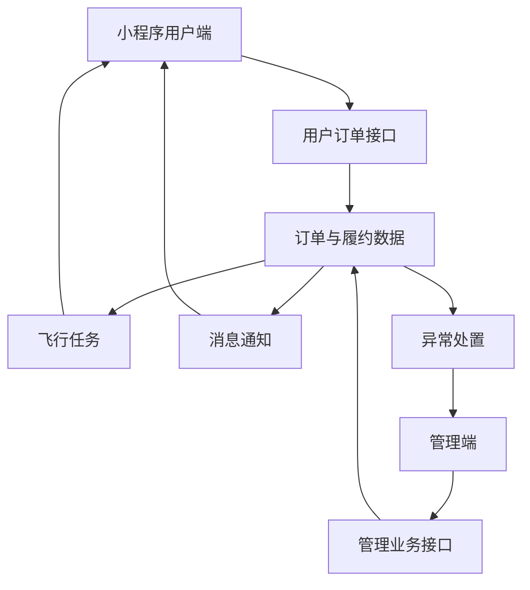

把管理端和小程序端分别做完，并不代表项目已经连起来。真正联调时，很多问题都发生在两个页面之间：管理端认为已经更新，小程序却不知道怎样展示；小程序提交了反馈，管理端却缺少足够的处理上下文。

## 1. 双端共享的接口契约

两个前端共同依赖以下数据：

| 领域 | 关键字段 |
| --- | --- |
| 订单 | `orderId`、`orderNo`、`orderStatus`、`serviceType` |
| 船舶地址 | 船名、MMSI、联系人、经纬度 |
| 飞行任务 | 任务编号、任务状态、起止时间、航线 |
| 凭证 | 凭证类型、排序、图片数据 |
| 消息 | 消息类型、关联订单、发送和已读状态 |
| 异常 | 异常编号、类型、来源、处理状态、关联订单 |

字段命名、枚举值和空值规则需要在接口文档中保持一致。

## 2. ID 与业务编号

系统内部存在多种编号：

```text
数据库 ID          用于接口和表关联
平台订单号 orderNo 用于用户与运营沟通
异常订单号         用于异常追踪
任务编号           用于飞行履约
```

页面跳转可以使用 ID，但卡片、消息、反馈和操作结果应该展示业务编号。这个边界一旦混乱，用户看到的内容就会像数据库调试页面。

## 3. 状态枚举需要统一解释

管理端关注可以执行什么操作，小程序关注用户当前能做什么。两边对同一状态的文案可以不同，但业务含义必须一致。

```text
管理端：WAIT_DISPATCH -> 可以开始飞行
小程序：WAIT_DISPATCH -> 待调度
```

状态转换集中到工具文件后，列表、详情、消息和卡片可以使用同一套规则。

## 4. 操作日志是联调线索

当订单状态不符合预期时，只查看订单主表很难判断问题。流程日志能够回答：

- 谁执行了操作；
- 操作发生在什么时间；
- 状态为什么变化；
- 是否产生异常单或飞行任务；
- 用户是否应该收到消息。

日志既是业务页面内容，也是联调时的重要线索。

## 5. 视觉组件的统一

小程序将重复视觉抽成公共组件：

```text
AppShell          页面结构与加载
AppHeader         顶部导航
OrderStatusCard   订单状态卡片
InfoCard          船舶信息卡片
UploadPanel       图片选择与预览
ConfirmPopup      二次确认
```

管理端则把订单操作和异常区块拆成独立组件。统一组件不仅减少代码，也让相同状态在不同页面保持一致。

## 6. 正常流程与异常流程同等重要

联调时不能只走“下单成功—审核通过—配送完成”的理想路线，还要覆盖：

1. 支付超时；
2. 审核退回后重新提交；
3. 飞行前取消；
4. 配送失败后重派；
5. 少件或破损后的补发；
6. 图片上传部分失败；
7. 消息列表翻页与详情返回；
8. 航线数据缺失时的降级展示。

异常场景越完整，项目才越接近真实使用。

## 7. 项目结构回顾



两个前端围绕同一批业务数据协作：小程序提供用户入口，管理端提供运营和履约能力。

## 8. 我的收获

这段开发经历让我积累的不只是 Vue 页面写法，还包括：

- 根据需求流程拆分模块；
- 用状态驱动页面操作；
- 设计列表与详情的路由关系；
- 处理移动端授权、滚动、键盘和地图；
- 让异常流程能够被跟踪和关闭；
- 在双端之间保持接口和业务语义一致。

## 9. 本篇总结

回头看，这个项目从用户下单开始，经过审核、飞行、消息、异常和报表，最后形成了一条完整链路。每个页面只负责其中一小段，但所有页面必须对订单当前在哪里达成一致。


`写到最后才发现，我不是做了很多互不相干的页面，而是在和订单一起，从小程序一路飞到了管理端。`
