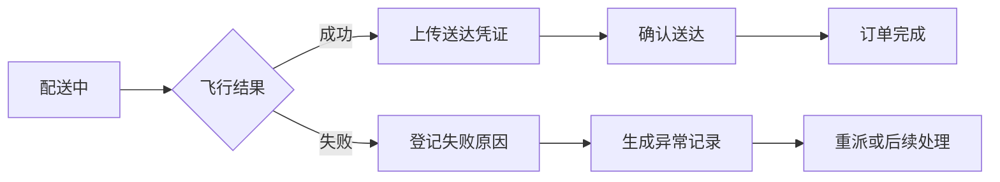

如果说订单中心负责回答“要送什么”，飞行任务模块负责回答的就是“怎么送、从哪里起飞、飞到哪里”。这部分业务把普通订单系统和低空物流真正区分开来。

## 1. 履约相关模块

管理端中与飞行履约直接相关的页面包括：

| 模块 | 职责 |
| --- | --- |
| 飞行任务 | 保存任务编号、任务状态、预计与实际时间 |
| 接驳点 | 维护无人机起降或中转位置 |
| 运营区域 | 维护可服务区域和业务边界 |
| 配送凭证 | 保存订单截图、货物图片和送达证明 |
| 订单流程日志 | 记录下单、审核、飞行、送达等节点 |

它们不会独立存在，而是通过订单 ID 和任务 ID 关联到同一条履约链路。

## 2. 开始飞行登记

待配送订单进入开始飞行登记时，需要确认当前订单、船舶收货位置和飞行任务信息。

```text
待配送订单
  ↓ 开始飞行登记
关联飞行任务与航线
  ↓
订单状态更新为配送中
  ↓
写入流程日志并通知小程序
```

开始飞行不是前端按钮状态的变化，而是多个业务对象同时进入新的阶段。

## 3. 地图中的关键对象

订单详情地图通常包含三类对象：

```text
起飞点 marker
目的地 marker
航线 polyline
```

地图数据需要统一经纬度字段，页面会从订单、飞行任务或航线数据中寻找可用坐标。当正式航线尚未返回时，也要明确展示错误或空状态，不能让地图假装一切正常。

## 4. 飞行时间与结果

履约过程中的时间字段可以分为计划与实际两类：

| 类型 | 示例 |
| --- | --- |
| 计划时间 | 计划起飞、预计到达 |
| 实际时间 | 实际起飞、实际到达、完成时间 |

订单详情将这些时间进一步转换为用户容易理解的结果：

- 实际配送时长；
- 飞行距离；
- 当前配送状态；
- 最终交付结果。

## 5. 配送凭证

凭证类型不止一种：

```text
ORDER_PHOTO       订单截图
GOODS_PHOTO       货物或取货凭证
DELIVERY_PROOF    送达凭证
EXCEPTION_FEEDBACK 异常反馈图片
```

订单详情会按照凭证类型分区展示，并根据排序字段保持上传顺序。管理端图片通常需要鉴权，因此使用单独组件请求二进制数据，再生成可展示地址。

## 6. 确认送达与失败分支



成功路径强调凭证和完成时间，失败路径强调失败原因、飞行处理结果和异常类型。两条路径都必须写入流程日志。

## 7. 流程日志

订单流程日志让详情页不只展示“现在是什么状态”，还能够解释“为什么到了这个状态”。

```js
{
  processTitle: '确认送达',
  processContent: '已上传送达凭证并完成交付',
  operatorName: '飞行操作员',
  operateTime: '2026-08-07 15:30:00'
}
```

这类记录对异常追踪和责任确认都很重要。

## 8. 本篇总结

飞行任务模块让我意识到，地图只是履约数据的一种表现形式。真正需要稳定的是订单、任务、航线、时间和凭证之间的关系。


`无人机在页面上只飞过几百个像素，背后却要带着订单、航线、时间和凭证一起落地。`
