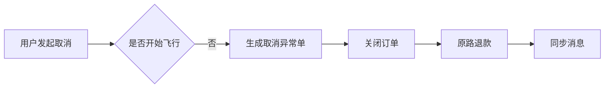

正常订单流程像一条规划好的航线，异常处置则像临时改航。改航不能只告诉系统“出问题了”，还要说明问题来自哪里、由谁确认、下一步怎么处理。

## 1. 异常处置模块结构

管理端将异常功能拆成列表、统计、筛选和处理页面：

```text
ExceptionTicket/
├── ExceptionTicketTable.vue
├── ExceptionListFilters.vue
├── TicketStatistics.vue
├── TicketOverview.vue
├── ExceptionProcessPage.vue
├── CloseExceptionDialog.vue
└── ProcessSection.vue
```

列表页负责发现问题，处理页负责解决问题。

## 2. 异常单的核心字段

| 字段 | 说明 |
| --- | --- |
| `exceptionId` | 异常记录主键，用于接口关联 |
| `exceptionOrderNo` | 异常业务编号，用于页面展示 |
| `orderId` | 关联原订单 |
| `exceptionType` | 取消、重派、补发等处理类型 |
| `processStatus` | 待处理、处理中、已完成、已关闭 |
| `severityLevel` | 普通、高、紧急等优先级 |
| `exceptionSource` | 小程序用户、履约过程或客服来源 |

异常编号在异常生成后保持不变，即使后续关联了子订单，也不会改变原来的追踪标识。

## 3. 统一处理页

三种异常共享同一个处理页面骨架：

```text
左侧：异常概览、订单信息、处理日志
右侧：当前异常类型对应的处理表单和结果
底部：返回、关闭异常、确认处理等操作
```

页面根据 `processType` 切换内容：

```js
const typeFallback = computed(() =>
  props.processType === 'CANCEL'
    ? '取消'
    : props.processType === 'REDISPATCH'
      ? '重派'
      : '补发'
)
```

这比为三种异常复制三套页面更容易保持信息结构一致。

## 4. 取消订单

取消处理关注退款和运力释放：



处理页展示支付金额、退款方式、退款状态和处理备注。运营确认后，订单状态与异常状态需要同时结束。

## 5. 重派送

重派通常由配送失败触发。处理人员需要查看原飞行任务、返航时间和失败原因，再登记重新配送信息。

```text
原订单配送失败
  ↓
异常单进入重派登记
  ↓
生成或恢复配送任务
  ↓
订单重新进入待配送队列
```

重派处理必须保留原配送结果，否则后续只能看到“又配送了一次”，却不知道为什么重来。

## 6. 补发子订单

补发适用于少件、破损、错发等用户反馈。确认补发后生成子订单，并保留：

- 子订单编号；
- 关联原订单；
- 关联异常单；
- 当前订单状态；
- 费用与审核方式。

原订单、异常单和补发子订单形成三角关系：

```text
原订单 <-> 异常单 <-> 补发子订单
```

用户和运营人员看到的是业务订单号，系统内部则继续使用 ID 完成关联。

## 7. 关闭异常

并非所有异常都需要进入取消、重派或补发。有些反馈经核实不成立，或已经通过其他方式解决，此时可以填写关闭结果并保留处理记录。

关闭并不等于删除。异常数据仍然用于后续查询、报表和客服回溯。

## 8. 本篇总结

异常模块最难的不是表单字段多，而是每一种处理都要同时照顾原订单、后续订单和用户感知。


`正常流程教我怎么把路走通，异常流程教我怎么在路不通的时候，仍然把每一步说清楚。`
