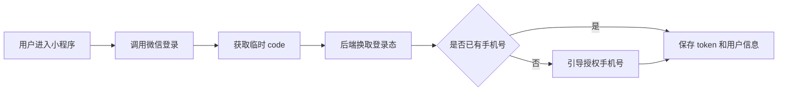

管理端面向熟悉业务的工作人员，小程序面对的则是随时可能第一次打开页面的普通用户。因此，小程序除了完成业务，还要处理授权、登录、手机号、隐私协议、页面加载和游客态。

## 1. 技术结构

小程序项目使用：

| 技术 | 作用 |
| --- | --- |
| uni-app | 多端页面与微信小程序编译 |
| Vue 3 | 组合式 API 和组件开发 |
| Pinia | 登录、订单、地址、消息和反馈状态 |
| Vant Weapp | 按钮、弹窗、图标等组件 |
| 微信原生能力 | 登录、手机号、定位、订阅消息、地图 |

主要目录如下：

```text
pages/       页面
components/  公共组件
store/       Pinia 状态
api/         业务接口
utils/       请求、登录、地图和表单工具
constants/   订单、消息、异常、凭证枚举
```

## 2. 页面壳组件

`AppShell` 统一处理页面容器、滚动方式、加载状态和登录弹窗。

```html
<AppShell
  active="orders"
  native-page-scroll
  pull-refresh-enabled
>
  <AppHeader title="我的订单" />
  <!-- 页面内容 -->
</AppShell>
```

不同页面可以选择原生页面滚动、内部滚动或完全锁定滚动，避免地图页、列表页和表单页互相套用同一种布局。

## 3. 登录流程

登录不是只有一次接口请求，而是一条微信授权链路：



登录相关能力分别封装在：

```text
utils/wx/login.js
utils/wx/phone.js
utils/wx/privacy.js
utils/wxLoginFlow.js
store/modules/auth.js
```

页面不需要重复拼装微信 API，只需要调用统一流程。

## 4. 请求封装

请求工具统一处理：

- 基础地址；
- Authorization Token；
- 加载提示；
- 重复请求取消；
- HTTP 与业务错误；
- 登录过期和 token 刷新；
- 是否展示错误提示。

业务 API 因此保持简洁：

```js
getOrderDetail(orderId) {
  return get(`/manage/user/delivery-order/${orderId}`)
}
```

## 5. 游客态

首页、订单和消息页面都需要考虑未登录用户。项目使用 `GuestFirstLevel` 给出统一提示，并通过 `AuthLoginPopup` 完成登录引导。

游客态不是把整个页面留白，而是告诉用户：

1. 登录后可以看到什么；
2. 为什么需要登录；
3. 从哪里开始登录。

## 6. Pinia 状态划分

| Store | 主要状态 |
| --- | --- |
| `auth` | token、用户信息、登录状态 |
| `order` | 下单表单、编辑订单、订单标签页 |
| `recipient` | 船舶地址与当前收货人 |
| `message` | 消息列表、分页、已读状态 |
| `feedback` | 异常类型、描述、上传图片 |

按照业务域拆分状态，比把所有字段塞进一个全局 store 更容易维护。

## 7. 页面加载体验

小程序接口和图片资源较多，页面加载不能只靠一个转圈图标。`PageLoading`、空状态、错误提示和下拉刷新共同组成完整反馈。

```text
首次进入 -> 页面加载
请求成功但无数据 -> 空状态
请求失败 -> 错误提示/重试
已有数据刷新 -> 保留旧内容并更新
```

## 8. 本篇总结

小程序基础架构的目标，是让后续页面专注业务，而不是每写一个页面就重新处理登录、滚动和错误提示。


`基础组件平时很低调，但它们一旦请假，所有页面都会立刻开始各显神通。`
